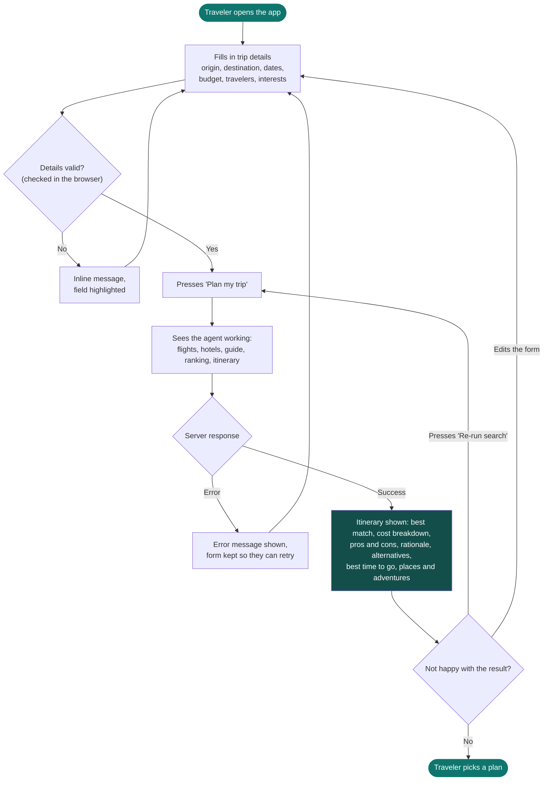
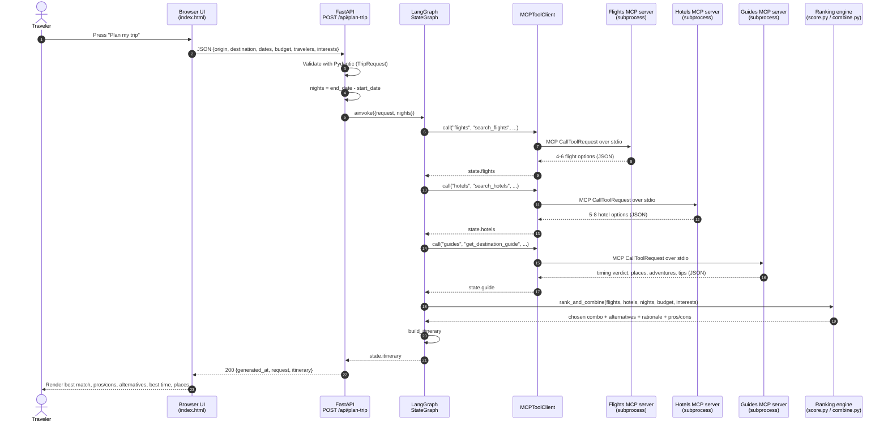
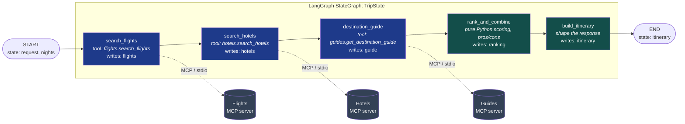
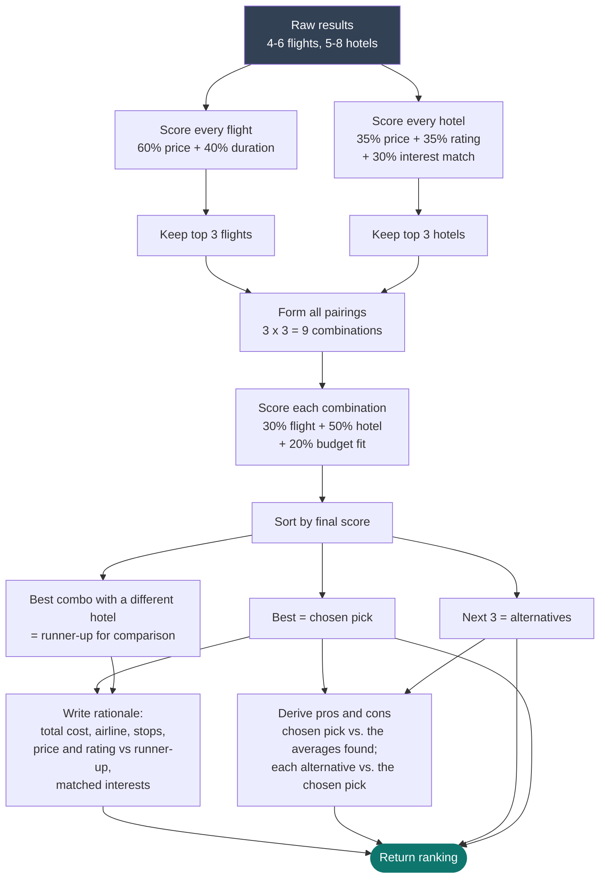
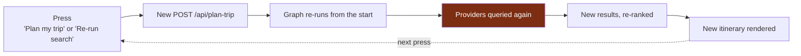
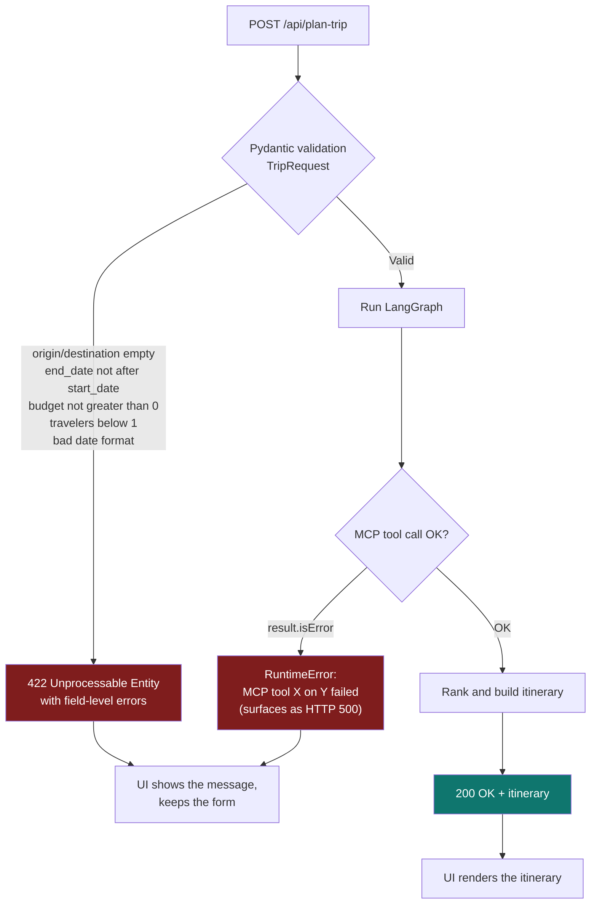
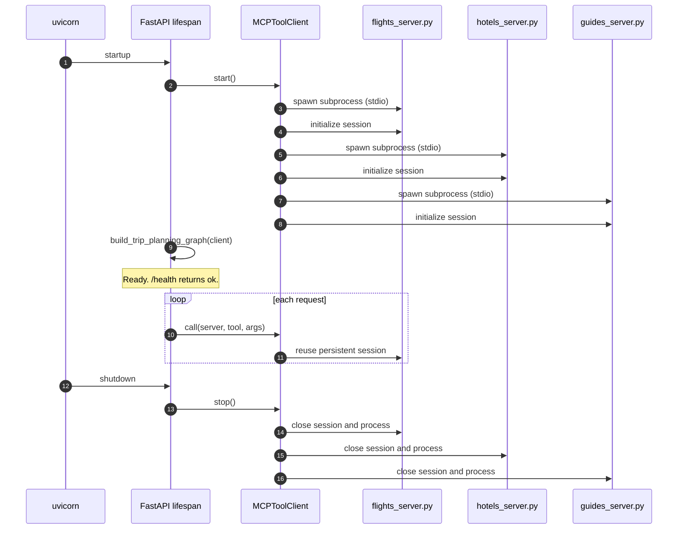
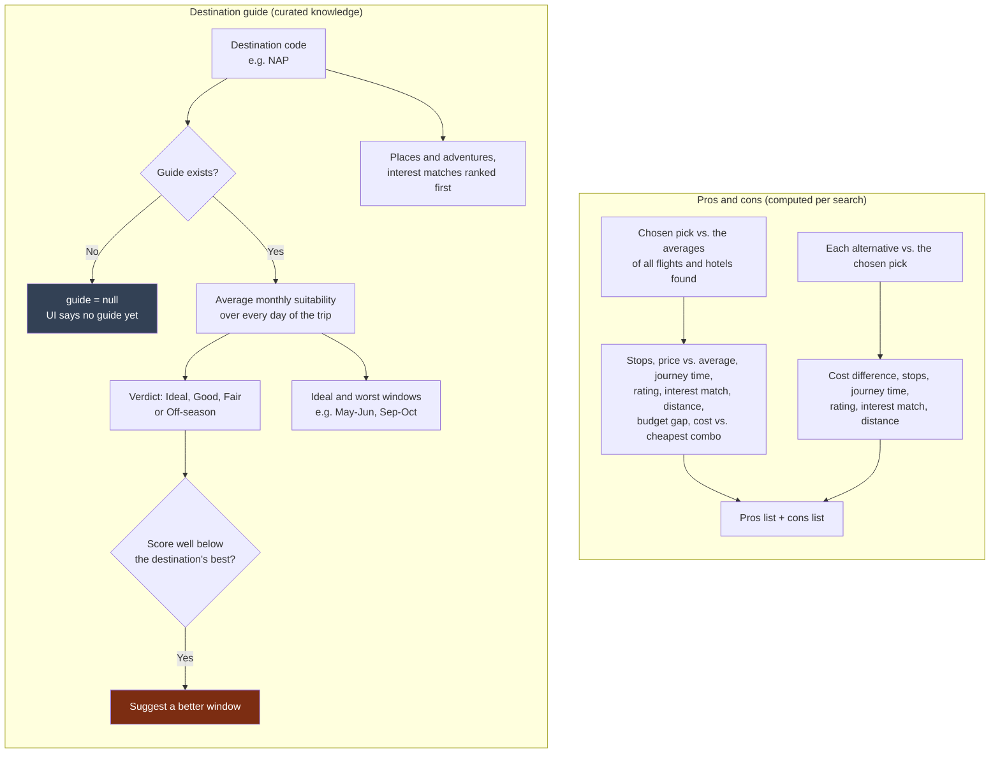

# 01 · System flows

How a trip request moves through the system, from the traveler's click to the itinerary on screen.
Every flow below reflects the code as it exists today (`backend/app/…`). Where something is
planned but not built, it is marked **(planned)**.

> Diagrams are [Mermaid](https://mermaid.js.org/). They render on GitHub and in VS Code with the
> *Markdown Preview Mermaid Support* extension.

**Contents**

1. [User journey](#1-user-journey)
2. [End-to-end request sequence](#2-end-to-end-request-sequence)
3. [The LangGraph pipeline](#3-the-langgraph-pipeline)
4. [Ranking decision flow](#4-ranking-decision-flow)
5. [The "Refresh" flow](#5-the-refresh-flow)
6. [Validation and error handling](#6-validation-and-error-handling)
7. [Application lifecycle](#7-application-lifecycle)
8. [Destination guide and pros/cons flow](#8-destination-guide-and-proscons-flow)

---

## 1. User journey

What the traveler does and sees.

> The "agent working" steps in the browser are a timed animation (about 1.7 s minimum). The real
> work is the single `POST /api/plan-trip` call; the browser does not yet receive per-step progress
> events. Streaming real progress is a natural next step.

---

## 2. End-to-end request sequence

Every actor that touches one request, in order.

Key point: the graph nodes never import the flight or hotel code. They call tools **by name**
through the MCP client, so a real provider can replace a mock without touching the orchestration.

---

## 3. The LangGraph pipeline

The orchestration is a real `langgraph.graph.StateGraph` ([graph.py](../backend/app/graph.py)).
Each node reads from and writes to one shared state object ([state.py](../backend/app/state.py)).

| Node | Reads from state | Writes to state | How it works |
|---|---|---|---|
| `search_flights` | `request` | `flights` | Calls the flights MCP tool with origin, destination, dates, travelers |
| `search_hotels` | `request` | `hotels` | Calls the hotels MCP tool with destination, dates, travelers, interests |
| `destination_guide` | `request` | `guide` | Calls the guides MCP tool for season fit, places, adventures ([section 8](#8-destination-guide-and-proscons-flow)). If it fails or the destination has no guide, `guide` is `null` and the plan still completes |
| `rank_and_combine` | `flights`, `hotels`, `nights`, `request` | `ranking` | Scores and pairs the best options, then derives pros and cons ([section 4](#4-ranking-decision-flow)) |
| `build_itinerary` | `ranking`, `guide`, `request`, `nights` | `itinerary` | Assembles the response, sets `within_budget` |

Flights and hotels are independent, so today they run one after the other. They could run in
parallel and join before ranking; the code comment in `graph.py` notes this.

**When this grows (planned):** rental cars, restaurants and attractions become extra nodes with
their own MCP servers. A router node can then send follow-ups such as *"remove the rental car"* to
only the affected branch instead of re-running everything. This is where LangGraph's state model
pays off.

---

## 4. Ranking decision flow

What `rank_and_combine` does with the raw search results ([combine.py](../backend/app/ranking/combine.py)).
The scoring math is in [03 · Technology and models](03-technology-and-models.md#scoring-model).

**Why not just pick the cheapest?** A slightly pricier combination that matches the traveler's
interests and rating expectations can outrank the cheapest one. That difference is the product's
core value over a plain price comparison.

---

## 5. The "Refresh" flow

The original brief: *"it is refreshed each time you press the button."*

Nothing is cached or stored between presses, so each press is a fresh search. Today the providers
are mocks that generate new random prices and availability on every call, so results visibly change.
With real providers the same flow returns live prices. **(planned)** A cache layer would avoid
re-querying providers when nothing has changed.

---

## 6. Validation and error handling

The browser also validates before sending (missing fields, same origin and destination, return
before departure), so most mistakes never reach the server.

---

## 7. Application lifecycle

The three MCP servers are **long-lived processes**, started once with the API and reused for every
request, not launched per request.

A single `AsyncExitStack` owns both sessions, so shutdown closes both cleanly even if one fails.

---

## 8. Destination guide and pros/cons flow

Two features that turn a ranked list into advice. They work differently, and the difference matters:

- **Pros and cons are computed.** Each line is derived from real numbers in *this* search.
- **The destination guide is curated.** It is hand-written knowledge served by the guides MCP tool, standing in for a future RAG knowledge base.

**Best-time scoring.** Each destination stores a 1 to 5 suitability score per month (weather, crowds,
peak-season pressure). The trip is scored by averaging that value over **every day** of the trip, so a
trip that straddles two months is weighted correctly. Verdict thresholds: 4.5 and above is *Ideal*,
3.5 and above *Good*, 2.5 and above *Fair*, below that *Off-season*.

**Coverage today:** Naples/Amalfi, Lisbon, Tokyo, Dubai, Barcelona, Rome, Paris, Athens, New York and
Tel Aviv. Any other destination still gets a full ranked plan, just without the guide.
