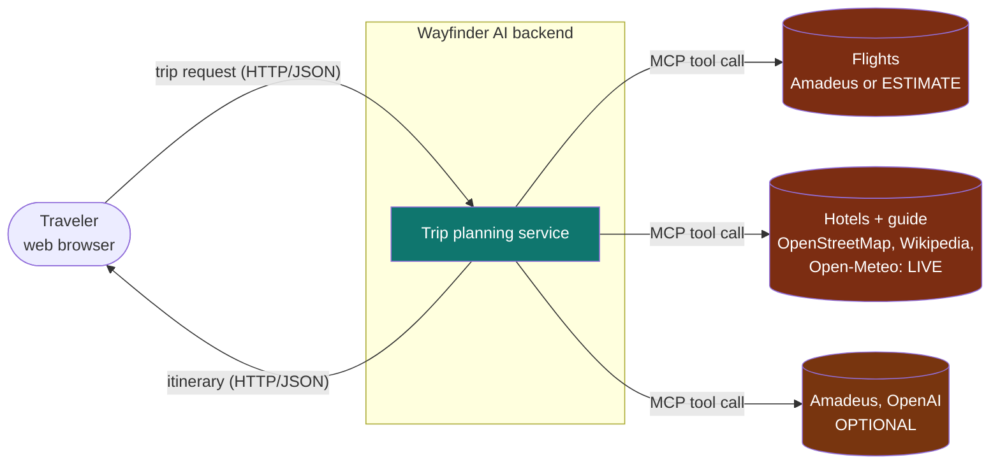
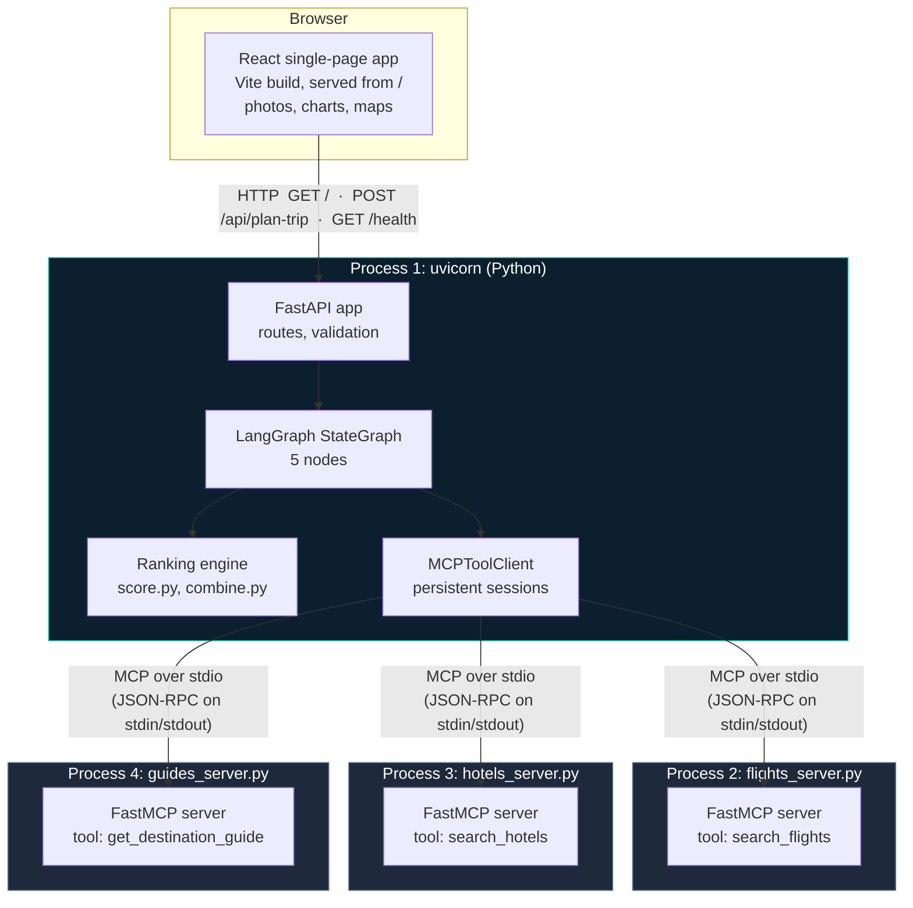
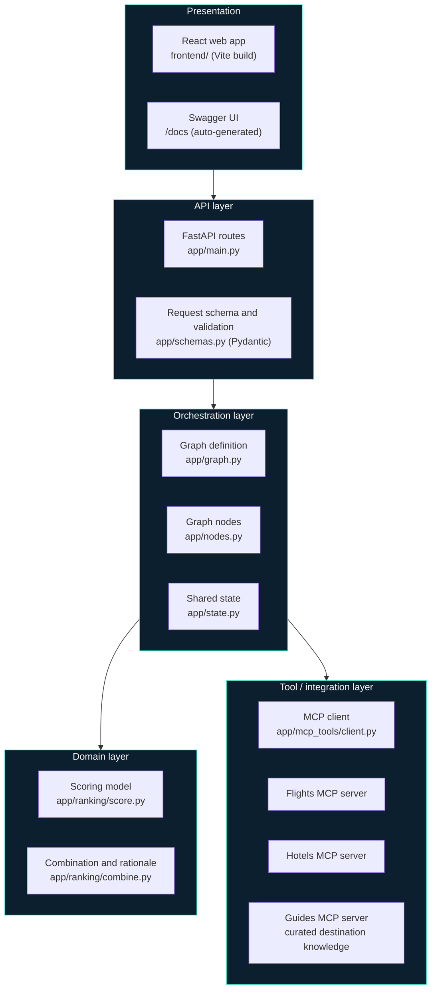
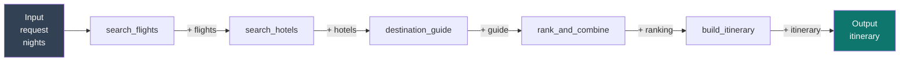
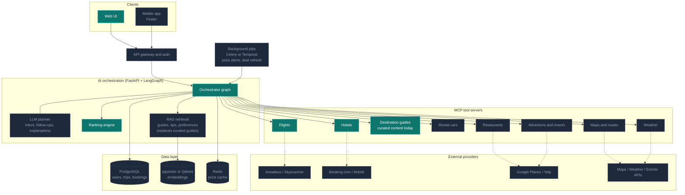
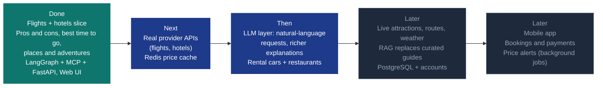

# 02 · Architecture

Where the pieces live and how they connect. Diagrams marked **Current** describe what runs today.
The **Target** diagram shows the direction from [requirement.txt](../requirement.txt) and is not built.

**Contents**

1. [System context](#1-system-context-current)
2. [Runtime architecture](#2-runtime-architecture-current)
3. [Layered view](#3-layered-view-current)
4. [Code map](#4-code-map-current)
5. [Shared state and data flow](#5-shared-state-and-data-flow-current)
6. [API surface](#6-api-surface-current)
7. [Target architecture](#7-target-architecture-planned)
8. [What is real, estimated and demo](#8-what-is-real-estimated-and-demo)
9. [Roadmap](#9-roadmap)

---

## 1. System context (Current)

The system as a black box: who uses it and what it talks to.



Orange marks estimated or optional parts. The live free sources are detailed in [05 · Live data and AI](05-live-data-and-ai.md).

---

## 2. Runtime architecture (Current)

What actually runs when you start the app: **one API process plus three tool-server processes**.



Why separate processes: each provider is isolated, so a slow or crashing provider cannot take down the
API. It also mirrors how production MCP servers behave, so swapping a mock for a real service changes
the server, not the orchestration.

---

## 3. Layered view (Current)



The domain layer (scoring) is pure Python with no I/O, which is why it is fully unit-tested without
starting any server.

---

## 4. Code map (Current)

```
travelAgentAi/
├── backend/                     Primary implementation (Python)
│   ├── app/
│   │   ├── main.py              FastAPI app, lifespan, routes
│   │   ├── schemas.py           TripRequest (Pydantic validation)
│   │   ├── state.py             TripState (shared LangGraph state)
│   │   ├── graph.py             StateGraph wiring: nodes and edges
│   │   ├── nodes.py             The five graph nodes
│   │   ├── ranking/
│   │   │   ├── score.py         Flight, hotel, and combination scoring
│   │   │   └── combine.py       Pairing, ranking, rationale, pros/cons
│   │   ├── live/                Live sources: catalog (109 cities), climate, places, osm, amadeus, llm, pricing,
│   │   │                        travel.py (flight and stay search: Amadeus, Travelpayouts, estimates), geo.py (distances), nearby, guide,
│   │   │                        nightlife.py (Tonight: best clubs and bars for one night),
│   │   │                        photos.py (finds a credited photo for activities, beaches, zoos and other photo-less items)
│   │   ├── partners/            The partner side, see doc 07
│   │   │   ├── db.py            SQLite schema and connections (backend/data/partners.db)
│   │   │   ├── security.py      scrypt passwords, hashed tokens and keys, rate limiter
│   │   │   ├── accounts.py      Sign-up, sessions, API keys, suspension
│   │   │   ├── deals.py         Deal validation, moderation, payment-blind ranking
│   │   │   ├── featured.py      Featured deal placements: the one thing money buys, kept out of ranking (see stripe_gateway.py)
│   │   │   ├── stripe_gateway.py  Optional real payment (Stripe Checkout + webhook signature verification), no SDK
│   │   │   ├── routes.py        The partner, moderation, feed, deals, events and payments endpoints
│   │   │   ├── demo_businesses.py  The labelled pool of 124 demo businesses, their daily deals and drawn pictures
│   │   │   └── activity.py      Runtime log of partner events (backend/logs/partner-activity.md)
│   │   ├── social/              Wayfinder People, see doc 09
│   │   │   ├── users.py         Traveler accounts (18+), profiles, photos, blocks
│   │   │   ├── moderation.py    Photo and text checks (OpenAI moderation, free) and photo validation
│   │   │   ├── places.py        Registering to places and seeing who is going
│   │   │   ├── intents.py       Reading a looking-for request and matching people
│   │   │   ├── connect.py       Connection requests, chat, reports, bans
│   │   │   ├── vocab.py         The fixed lists of activities, languages, vibes, genders and age bands, and the gender and age detectors
│   │   │   ├── demo_people.py   The labelled pool of 100 demo travelers: seeding, daily requests, dynamic matching, automated replies
│   │   │   ├── avatars.py       Illustrated avatars (SVG) for demo profiles
│   │   │   ├── safety.py        "Meet safely" check-in links: share a planned meetup outside the app, no sign-in to view
│   │   │   ├── push.py          Optional real Web Push (RFC 8291/8292), no SDK: subscriptions, encryption, and the send itself
│   │   │   └── routes.py        The /api/people, /api/push, /api/safety and /api/admin/people endpoints
│   │   ├── alerts.py            The radar: deal, person, request and message alerts, and the RSS feed
│   │   ├── suppliers/           Optional real-time adapters: ticketmaster.py (events), travelpayouts.py (fares)
│   │   ├── docsync.py           Generates docs/08-api-reference.md from the code
│   │   ├── mcp_tools/
│   │   │   ├── client.py        MCPToolClient (spawns and calls servers)
│   │   │   ├── flights_server.py  MCP server: search_flights (Amadeus / estimates, demo fallback)
│   │   │   ├── hotels_server.py   MCP server: search_hotels (OpenStreetMap, demo fallback)
│   │   │   ├── guides_server.py   MCP server: get_destination_guide
│   │   │   └── guides_data.py     Curated guides + best-time scoring
│   │   └── static/index.html    Fallback page (used if the React build is absent)
│   ├── scripts/fetch_photos.py   Downloads licensed photos from Wikimedia Commons
│   ├── scripts/sync_docs.py      Regenerates the API reference (a test fails if it is stale)
│   ├── scripts/seed_demo.py      Adds or removes clearly-labelled demo partners and deals
│   ├── scripts/seed_people.py    Adds or removes clearly-labelled demo travelers
│   ├── scripts/generate_demo_photos.py  Makes AI portraits of fictional people for the demo travelers (uses your OpenAI key)
│   └── tests/                   125+ tests: ranking, guides, live data, nearby, partners, API, docs in sync
├── frontend/                    React + Vite web app (pages, charts, maps, photos)
├── node-slice/                  Earlier zero-dependency Node.js proof of concept
├── docs/                        This documentation
└── requirement.txt              Original product brief
```

---

## 5. Shared state and data flow (Current)

`TripState` is the single object passed through the graph. Each node adds to it and never mutates
another node's output.



| Stage | State after the stage |
|---|---|
| Input | `request`, `nights` |
| After `search_flights` | + `flights` (list) |
| After `search_hotels` | + `hotels` (list) |
| After `destination_guide` | + `guide` (season fit, places, adventures; or `null`) |
| After `rank_and_combine` | + `ranking` (`chosen`, `alternatives`, `rationale`, pros and cons) |
| After `build_itinerary` | + `itinerary` (returned to the client) |

State lives only for the duration of one request. Nothing is persisted.

---

## 6. API surface (Current)

| Method | Path | Purpose |
|---|---|---|
| `GET` | `/`, `/trip`, `/stays`, `/explore`, `/credits` | The React app (client-side routes) |
| `GET` | `/assets/*`, `/photos/*` | Built JS/CSS and bundled destination photos |
| `POST` | `/api/plan-trip` | Plan a trip. Body: `TripRequest`. Returns the itinerary: best match, pros and cons, alternatives, destination guide |
| `GET` | `/health` | Liveness check (used by the UI's "Agents online" indicator) |
| `GET` | `/docs`, `/redoc`, `/openapi.json` | Auto-generated interactive API documentation |

---

## 7. Target architecture (Planned)

The end state described in the product brief. **Green = built today. Grey dashed = not built.**



Stack choices come from [requirement.txt](../requirement.txt): Flutter, FastAPI, LangGraph, MCP,
pgvector or Qdrant, PostgreSQL, Redis, Celery or Temporal.

---

## 8. What is real, estimated and demo

| Area | Status | Detail |
|---|---|---|
| Web UI | Real | React + Vite multi-page app with photos, maps and charts. See [04](04-frontend-and-visual-experience.md) |
| REST API and validation | Real | FastAPI + Pydantic |
| Orchestration | Real | Actual LangGraph `StateGraph`, not a hand-rolled loop |
| Tool protocol | Real | Actual MCP SDK; servers run as separate processes over stdio |
| Ranking | Real | Deterministic weighted scoring, unit-tested |
| Weather, sights, photos, hotels, restaurants (109 cities) | **Live** | Open-Meteo, Wikipedia/Wikimedia, OpenStreetMap. Free, no keys |
| Flight and hotel **prices** | **Estimate**, or **Live** with Amadeus keys | Modelled from distance, star class, city level and season unless Amadeus is configured. Always labelled |
| Demo fallback | Simulated | Used only when live sources are unreachable, and labelled Demo |
| LLM | **Optional (OpenAI)** | Plain-English requests and grounded trip summaries when a key is set. Ranking and pros/cons stay rule-based |
| Destination guide (best time, places, adventures) | **Curated content** | Hand-written for 10 destinations, served through a real MCP tool. Not live data. This is the slot a RAG knowledge base fills later |
| Pros and cons | Real | Computed from the numbers in each search, not written by hand or by an LLM |
| RAG / vector store | Not built | |
| Persistence, accounts, bookings | Not built | Nothing is stored between requests |
| Nearby restaurants | **Live** | Real OpenStreetMap restaurants with real distances. No prices, reviews or discounts: free data has none |
| Destination photos | Real, licensed | Wikimedia Commons, credited in the app |
| Rental cars, live restaurants and attractions, routes, weather | Not built | |
| Mobile app | Not built | |

---

## 9. Roadmap


