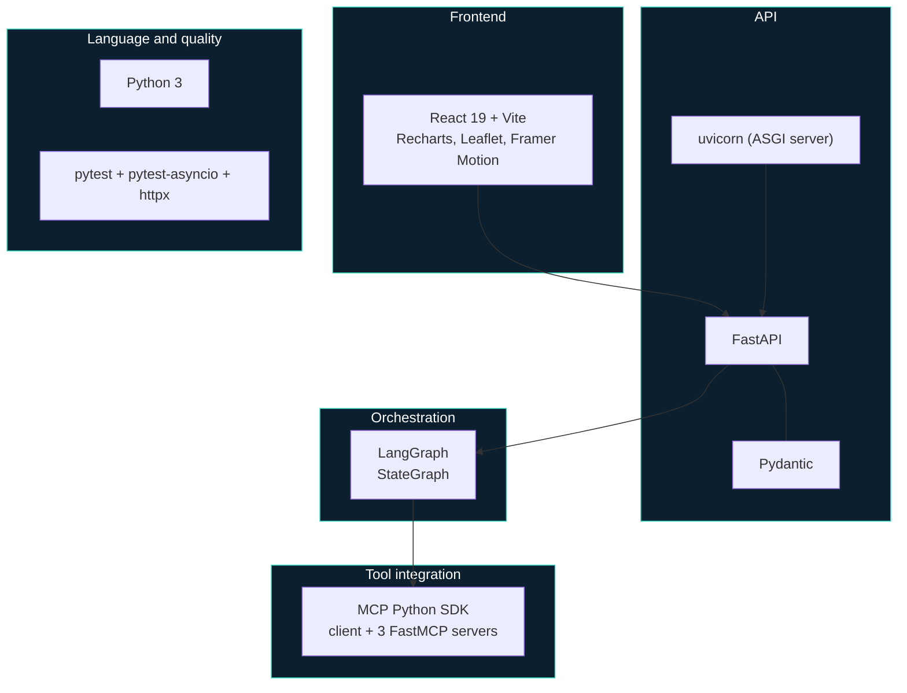
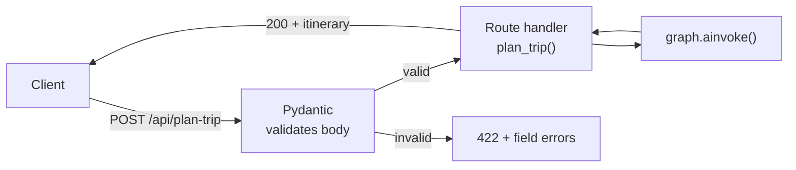
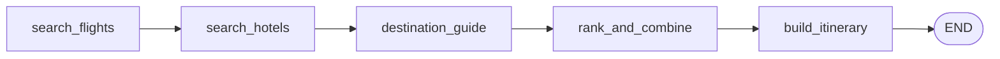
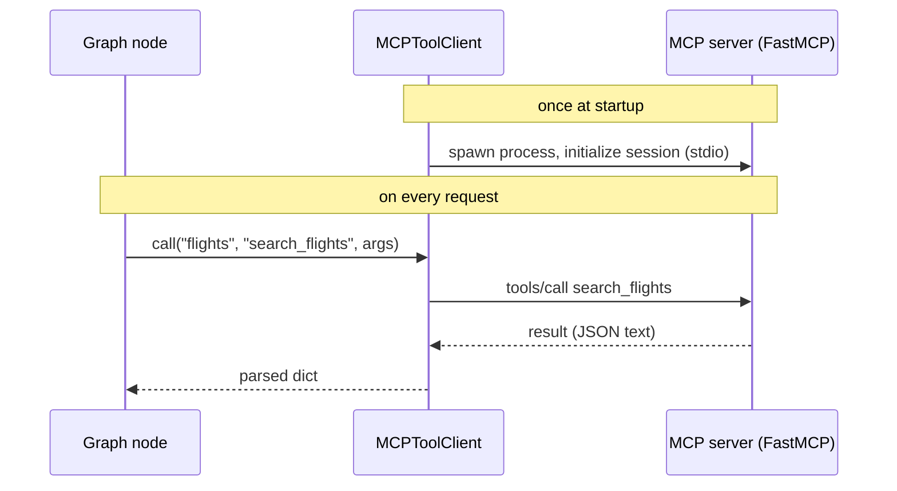
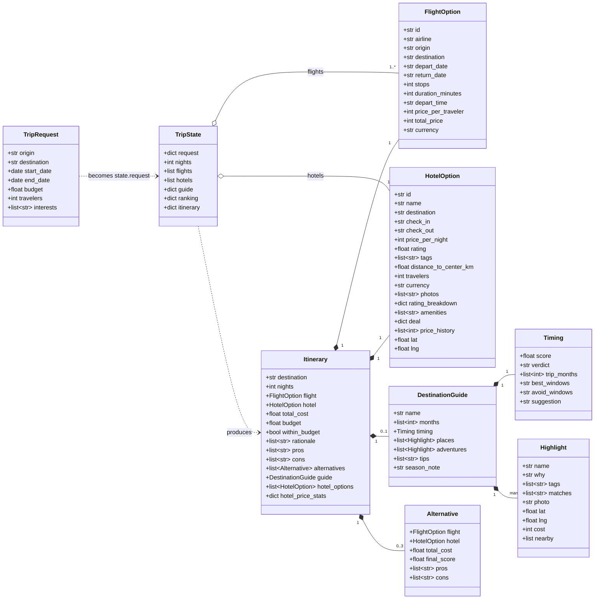
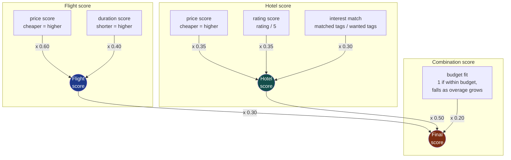

# 03 · Technology and models

Part A explains each technology used and the role it plays. Part B explains each model: the data
models that carry information through the system, and the scoring model that makes the decision.

**Contents**

- **Part A: Technology**
  [Stack at a glance](#stack-at-a-glance) ·
  [FastAPI](#fastapi) · [Pydantic](#pydantic) · [LangGraph](#langgraph) · [MCP](#mcp-model-context-protocol) ·
  [uvicorn](#uvicorn) · [Web UI](#web-ui) · [pytest](#pytest)
- **Part B: Models**
  [Data models](#data-models) · [Scoring model](#scoring-model) · [Worked example](#worked-example) ·
  [Pros and cons model](#pros-and-cons-model) · [Destination guide model](#destination-guide-model) ·
  [About "AI" in this product](#about-ai-in-this-product)

---

# Part A · Technology

## Stack at a glance

| Technology | Role in the product | Why it was chosen | Where |
|---|---|---|---|
| **FastAPI** | HTTP API and static UI hosting | Fast, async, automatic validation and API docs | [main.py](../backend/app/main.py) |
| **Pydantic** | Validates every incoming trip request | Rejects bad input before any work happens | [schemas.py](../backend/app/schemas.py) |
| **LangGraph** | Orchestrates the multi-step planning workflow | Stateful graph fits a workflow that will grow and re-plan | [graph.py](../backend/app/graph.py) |
| **MCP** | Standard protocol for calling flight and hotel tools | Providers become swappable plug-ins, no hardcoding | [client.py](../backend/app/mcp_tools/client.py) |
| **uvicorn** | Runs the async web server | Standard ASGI server for FastAPI | run command |
| **React + Vite** | Traveler-facing multi-page app | Component model suits many data-rich pages; fast builds | [frontend/](../frontend) |
| **Recharts** | Donut, bar and sparkline charts | Declarative charts that map directly onto API data | [pages/](../frontend/src/pages) |
| **Leaflet + OpenStreetMap** | Interactive maps | Free, no API key | [MapView.jsx](../frontend/src/components/MapView.jsx) |
| **Framer Motion** | Page transitions and reveals | Polished feel with little code | [App.jsx](../frontend/src/App.jsx) |
| **pytest** | Automated tests | 28 tests covering scoring, guides, pros/cons and the API | [tests/](../backend/tests) |

---

## FastAPI

The public face of the backend. It receives requests, hands them to the orchestration graph, and
returns JSON. It also serves the web UI and generates interactive API docs at `/docs`.

Notable design choice: the MCP client and compiled graph are created **once at startup** using
FastAPI's `lifespan` hook and stored on `app.state`, not rebuilt per request. See
[lifecycle](01-system-flows.md#7-application-lifecycle).

## Pydantic

Defines `TripRequest` and enforces the rules the rest of the system can rely on.

| Field | Rule |
|---|---|
| `origin`, `destination` | Required, at least 1 character |
| `start_date`, `end_date` | Valid dates; `end_date` must be after `start_date` |
| `budget` | Optional; if given, must be greater than 0 |
| `travelers` | Integer, at least 1 (default 1) |
| `interests` | List of strings (default empty) |

## LangGraph

Runs the planning workflow as a **directed graph of steps sharing one state object**, instead of one
giant prompt or a tangle of function calls.

Why it matters for the product:

- **Extensible:** adding rental cars is adding one node and one edge.
- **Stateful:** the brief needs follow-ups like *"remove the rental car"*. State makes "change only what is affected" possible.
- **Inspectable:** the flow is explicit, so it can be traced, tested and explained.

Current use is a straight line. Branching, parallel fan-out and LLM decision nodes are the planned
next uses.

## MCP (Model Context Protocol)

An open standard for letting an application call external tools by name, with a defined schema. Here
each provider is an **MCP server** in its own process, and the backend is the **MCP client**.

| Concept | In this codebase |
|---|---|
| Transport | `stdio`: the server is a child process, messages flow over stdin/stdout |
| Server | `FastMCP` with `@mcp.tool()` functions: `search_flights`, `search_hotels`, `get_destination_guide` |
| Client | `MCPToolClient`: one persistent `ClientSession` per server |
| Error handling | If a tool reports `isError`, the client raises a `RuntimeError` naming the tool and server |

**Business value:** replacing the mock flights server with a real Amadeus-backed one changes the
server file only. The graph, ranking, API and UI stay untouched.

## uvicorn

The ASGI server that runs FastAPI: `python -m uvicorn app.main:app`. `--reload` restarts on code
changes during development.

## Web UI

A multi-page React app (Home, Your trip, Stays, Explore) built with Vite and served by FastAPI. It has its
own document: [04 · Front end and visual experience](04-frontend-and-visual-experience.md), covering the
page map, component architecture, photo licensing, maps and where each number comes from.

## pytest

28 tests, all passing:

| Suite | What it proves |
|---|---|
| `test_ranking.py` | Scoring and combination math: pure functions, no I/O |
| `test_guides.py` | Best-time scoring (including trips that span two months), month-window formatting, guide well-formedness, pros/cons content |
| `test_api.py` | Full API via `TestClient`, running the app's **real** lifespan so all three MCP subprocess servers actually start. Includes a destination with no guide |

Run: `.venv\Scripts\python.exe -m pytest -v` from `backend/`.

---

# Part B · Models

"Model" here means two things: the **data models** that carry information, and the **scoring model**
that turns options into a decision.

## Data models

| Model | Defined in | Purpose |
|---|---|---|
| `TripRequest` | [schemas.py](../backend/app/schemas.py) | What the traveler asks for, validated at the edge |
| `TripState` | [state.py](../backend/app/state.py) | The one object the graph passes between nodes |
| `FlightOption` | [flights_server.py](../backend/app/mcp_tools/flights_server.py) | One flight result from a provider |
| `HotelOption` | [hotels_server.py](../backend/app/mcp_tools/hotels_server.py) | One hotel result from a provider |
| `Itinerary` | [nodes.py](../backend/app/nodes.py) | The final answer returned to the client |
| `DestinationGuide`, `Timing`, `Highlight` | [guides_data.py](../backend/app/mcp_tools/guides_data.py) | Curated destination knowledge and the best-time assessment for the traveler's dates |

`FlightOption`, `HotelOption`, `Itinerary` and `Alternative` are plain dictionaries today; only
`TripRequest` is a formal Pydantic class. Promoting the rest to typed models is a straightforward
hardening step, and it would make the response schema appear in `/docs`.

Interest tags the hotel provider understands: `beachfront`, `nightlife`, `michelin-nearby`,
`supercar-rental-nearby`, `spa`, `family-friendly`, `old-town`, `rooftop-bar`, `quiet`, `pet-friendly`.

---

## Scoring model

The decision-making core ([score.py](../backend/app/ranking/score.py),
[combine.py](../backend/app/ranking/combine.py)). It is a **transparent weighted model**, not a black
box: every recommendation can be explained by its numbers.

All sub-scores run from 0 to 1. Price and duration are **normalized within the current result set**
(cheapest = 1, most expensive = 0), so scores are relative to what the market offered for this search.

### Formulas

| Score | Formula |
|---|---|
| Price / duration score | `(max - value) / (max - min)`, clamped to 0 to 1. If all values are equal, score is 1 |
| Flight score | `0.6 x price_score + 0.4 x duration_score` |
| Rating score | `rating / 5` |
| Interest match | `\|interests ∩ hotel tags\| / \|interests\|`. If the traveler chose no interests, a neutral `0.5` |
| Hotel score | `0.35 x price_score + 0.35 x rating_score + 0.30 x interest_match` |
| Total cost | `flight total_price + hotel price_per_night x nights` |
| Budget fit | `1 - max(0, total_cost - budget) / budget`, clamped to 0 to 1. No budget means `1` |
| **Final score** | `0.30 x flight_score + 0.50 x hotel_score + 0.20 x budget_fit` |

### Selection procedure

1. Score all flights, keep the **top 3**. Score all hotels, keep the **top 3**.
2. Pair them: 3 x 3 = **9 combinations**. Compute total cost, budget fit and final score for each.
3. Sort by final score. The winner is the **chosen pick**; the next three are the **alternatives**.
4. Write a plain-language rationale comparing the winner with the best combination that uses a different hotel.

### Design intent

- **Hotel counts most (50%)** because it drives the trip experience and is where interests apply.
- **Budget acts as a soft constraint (20%):** a plan slightly over budget is penalized in proportion, not discarded. The UI clearly flags "Over budget by £X".
- **Interests only affect hotels today.** They will extend to restaurants and attractions as those tools arrive.

### Worked example

Real output from the scoring code. Trip: 5 nights, budget £2,000, interests `beachfront` and `nightlife`.

**Flights**

| ID | Price / traveler | Duration | Price score | Duration score | Flight score |
|---|---|---|---|---|---|
| F1 | £300 | 3h 00m | 0.000 | 1.000 | 0.400 |
| F2 | £150 | 5h 00m | 0.750 | 0.714 | **0.736** |
| F3 | £100 | 10h 00m | 1.000 | 0.000 | 0.600 |

**Hotels**

| ID | Per night | Rating | Tags | Price score | Rating score | Interest match | Hotel score |
|---|---|---|---|---|---|---|---|
| H1 | £100 | 4.5 | beachfront, spa | 0.714 | 0.900 | 0.5 | **0.715** |
| H2 | £200 | 4.9 | beachfront, nightlife | 0.000 | 0.980 | 1.0 | 0.643 |
| H3 | £60 | 3.5 | quiet | 1.000 | 0.700 | 0.0 | 0.595 |

**Top combinations** (the model's ranked output)

| Rank | Flight | Hotel | Total cost | Budget fit | Final score |
|---|---|---|---|---|---|
| 1 (chosen) | F2 | H1 | £800 | 1.0 | **0.778** |
| 2 | F2 | H2 | £1,300 | 1.0 | 0.742 |
| 3 | F3 | H1 | £700 | 1.0 | 0.738 |
| 4 | F2 | H3 | £600 | 1.0 | 0.718 |

The winner is **not** the cheapest combination (F2 + H3 at £600 ranks 4th) and **not** the hotel with
the best interest match (H2). It is the balance of price, rating, interests and budget. The generated rationale:

> *Total estimated cost £800 via B (1 stop) + Hotel X. Hotel X is £100 less per night than Hotel Y, with a lower rating (4.5 vs 4.9) than it. It also matches your interests: beachfront.*

---

## Pros and cons model

Every recommendation is paired with strengths and drawbacks ([combine.py](../backend/app/ranking/combine.py)).
Each line is **derived from a number in the current search**, so nothing is generic filler.

**For the chosen pick**, measured against the averages of everything the search returned:

| Signal | Shown as a pro when | Shown as a con when |
|---|---|---|
| Stops | Direct, or one connection | Two or more stops |
| Flight price | Below the average of options found | Above the average |
| Journey time | 15+ minutes faster than average | 15+ minutes slower |
| Hotel rating | 4.5 or higher | Below 4.0 |
| Interests | Lists the ones matched | Lists the ones not covered |
| Location | Within 2 km of the centre | More than 5 km away |
| Hotel rate | | More than 15% above the average rate |
| Budget | Money left under budget | Amount over budget |
| Total cost | It is the cheapest shortlisted combination | Amount above the cheapest combination |

**For each alternative**, measured against the chosen pick: cost difference, stops, journey time
(30+ minutes), hotel rating (0.2+), interests matched, and distance to centre (1+ km). If nothing
differs, it says so plainly rather than inventing a difference.

If a pick has no real drawbacks the UI shows *"No significant drawbacks against your criteria"*, so an
empty cons list is a real result and not a missing feature.

## Destination guide model

Answers "when is the ultimate time to go, and what should I do there?" The content is **curated
and static**, served by the guides MCP tool ([guides_data.py](../backend/app/mcp_tools/guides_data.py)).

| Field | Meaning |
|---|---|
| `months` | 12 scores from 1 to 5 (Jan to Dec) for weather, crowds and peak-season pressure |
| `timing.score` | Average of the monthly score over every day of the trip |
| `timing.verdict` | Ideal (4.5+), Good (3.5+), Fair (2.5+), Off-season (below) |
| `timing.best_windows` | Months at the destination's top score, merged into ranges, for example `May-Jun, Sep-Oct` |
| `timing.avoid_windows` | Months scoring 2 or below |
| `timing.suggestion` | Set when the trip scores well below the destination's best |
| `places`, `adventures` | Curated highlights; those matching the traveler's interests are listed first and flagged |

Coverage: Naples/Amalfi, Lisbon, Tokyo, Dubai, Barcelona, Rome, Paris, Athens, New York, Tel Aviv.
Other destinations get a full ranked plan without the guide.

---

## About "AI" in this product

Being precise about this matters, so here it is plainly.

| Component | Today | Planned |
|---|---|---|
| Orchestration | LangGraph workflow | Same, with branching and re-planning |
| Ranking | Deterministic weighted model (above) | Same model as a transparent baseline; weights could be learned from user behavior |
| Rationale text and pros/cons | Rule-based templates filled with real numbers | LLM-written explanations grounded in the same numbers |
| Best time, places, adventures | Hand-curated guide for 10 destinations, served via MCP | RAG over travel guides and live sources, any destination |
| Understanding the request | Structured form | LLM parses natural language, for example *"10 days in Italy, £2,500, I like Ferrari and nightlife"* |

**No large language model is called today.** The product's current intelligence is the orchestration
and the ranking model. That is a deliberate, testable foundation: the LLM and RAG layers plug into the
existing graph as additional nodes. Prices and availability come from tools (MCP), never from an LLM,
which is the right design for data that must be accurate.
