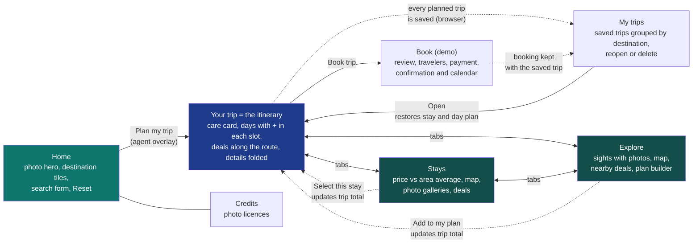
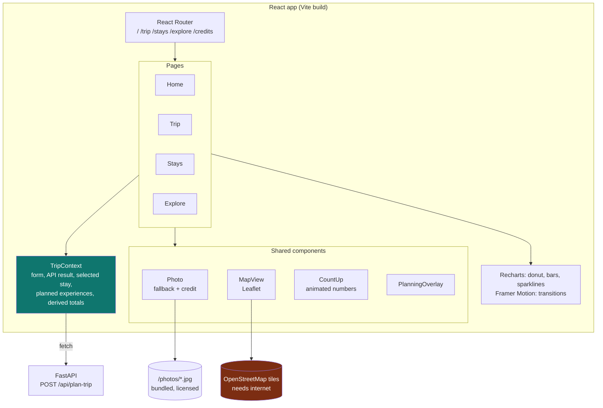
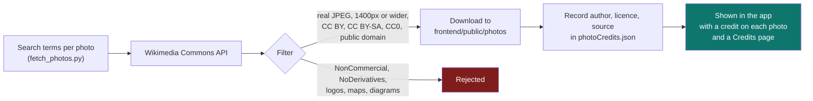
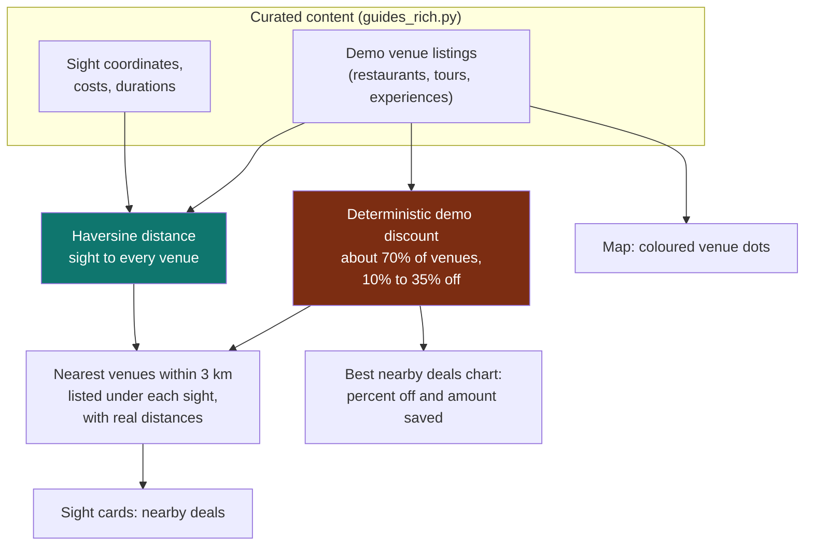

# 04 · Front end and visual experience

The traveler-facing app: a multi-page React single-page application that turns the API's data
into photos, maps and charts. It lives in [frontend/](../frontend) and is served by FastAPI in production.

> **Live data.** The app now runs on free live sources for 109 destinations. Where this document says "demo", that
> describes the offline fallback or the four hand-curated showcase cities. See [05 · Live data and AI](05-live-data-and-ai.md)
> for what is live, estimated or demo. The UI labels each one.

**Contents**

1. [Page map](#1-page-map)
2. [Front-end architecture](#2-front-end-architecture)
3. [What powers each screen](#3-what-powers-each-screen)
4. [Photo pipeline and licensing](#4-photo-pipeline-and-licensing)
5. [Maps, "nearby" and deals](#5-maps-nearby-and-deals)
6. [Where every number comes from](#6-where-every-number-comes-from)
7. [Running and building](#7-running-and-building)

---

## 1. Page map



The three trip pages share one piece of state, so choices carry across them: picking a different stay or
adding an experience immediately changes the total, the donut chart and the itinerary on **Your trip**.

---

## 2. Front-end architecture



| Library | Used for |
|---|---|
| React 19 + React Router | Pages and navigation |
| Vite | Dev server and production build |
| Recharts | Cost donut, monthly season chart, price comparison, deal bars, price sparklines |
| Leaflet + OpenStreetMap | Interactive maps for stays and sights |
| Framer Motion | Page transitions, scroll reveals, the planning overlay |

---

## 3. What powers each screen

All screens are driven by the single `POST /api/plan-trip` response.

| Screen element | API field | Notes |
|---|---|---|
| Trip total and per-person cost | `itinerary.flight`, `hotel_options[]`, guide item `cost` | Recomputed live when you change stay or plan |
| Donut: flights / stay / experiences | Same three components | Experiences are per-person estimates x travelers |
| Itinerary timeline | `flight`, selected hotel, planned experiences | Experiences spread over the free days |
| "Your stay, in detail" card on the Trip page | Same `hotel_options[]` entry as the Stay cards below, for the currently chosen hotel | Photo previews, quality, nightly/total price with source, distance and nearby bars/restaurants/beach, amenities and a map pin, without leaving the overview |
| Pros and cons | `itinerary.pros`, `cons`, `rationale` | Computed from the search, see [03](03-technology-and-models.md#pros-and-cons-model) |
| Season chart, verdict, best window | `guide.months`, `guide.climate`, `guide.timing` | Live weather (Open-Meteo) |
| Stays comparison chart | `hotel_options[].price_per_night`, `hotel_price_stats.avg` | Bars vs the average line |
| Stay cards | `hotel_options[]`: `stars`, `amenities`, `signals`, `website`, `price_source`, `lat`, `lng` | Real OpenStreetMap data. `deal`, `price_history` and `rating_breakdown` exist only in the demo fallback |
| Sight cards and map pins | `guide.places[]`, `adventures[]`: `photo` or `photo_url`, `photo_credit`, `lat`, `lng`, `nearby[]` | Wikipedia (live), or curated for the four showcase cities (adds `cost`, `duration`) |
| Nearby food, and the deal chart | `guide.venues[]`, item `nearby[]` | Real OpenStreetMap restaurants with real distances. The deal chart appears only for demo data, since free data has no discounts |

If live sources fail for a destination, the app degrades gracefully: the Trip and Stays pages still work
and Explore explains that a guide is not available.

---

## 4. Photo pipeline and licensing

Real photographs of the destinations, with correct credit. The four showcase cities use bundled photos (below) and work
offline. Every other city loads its lead and sight photos live from Wikimedia Commons, with the same licence filter and
credit shown on the image.



- **42 photos** are bundled: 36 destination and sight photos plus 6 generic hotel-interior images.
- The hotels in the demo are fictional, so their photos are generic illustrations, labelled **"Illustrative photo"** on every stay card.
- Every destination photo shows author and licence on hover, and all credits are listed on the **Credits** page.
- Re-run `backend/scripts/fetch_photos.py` to refresh or extend the set; it skips photos it already has.

---

## 5. Maps, "nearby" and deals

> In **live mode** nearby venues are real OpenStreetMap restaurants with real distances and **no prices or discounts**.
> The pipeline below (fictional venues with synthetic discounts) is the **offline demo fallback** only.



- **Real:** the distance from each sight to each venue is calculated from coordinates.
- **Demo:** the venue names, prices, ratings and discounts are synthetic, and the venues are fictional. Every place they appear is labelled **"demo"**.
- Discounts are deterministic (the same venue always shows the same discount), so the demo is repeatable.

---

## 6. Where every number comes from

Being clear about this is what makes the demo credible.

| Data | Source | Status |
|---|---|---|
| Flight and hotel prices | Amadeus if configured, otherwise labelled estimates ([05](05-live-data-and-ai.md)) | **Live** or **Estimate** |
| Hotels, amenities, neighbourhood signals | OpenStreetMap | **Live** |
| Hotel discounts, price history, rating breakdown | Only in the offline demo fallback | **Demo** |
| Ranking, scores, pros and cons, trip totals | Computed from the search results | **Real logic** |
| Distances between sights and venues | Haversine on coordinates | **Real calculation** |
| Best time to go, places, adventures, costs, tips | Hand-curated guide, 4 showcase destinations plus 6 text-only | **Curated** |
| Nearby restaurants | OpenStreetMap, real distances; no prices or discounts | **Live** |
| Destination photos | Wikimedia Commons, credited | **Real, licensed** |
| Hotel photos | Generic illustrations | **Illustrative** |
| Map | OpenStreetMap | **Real** |

Showcase destinations with the full visual experience: **Naples & Amalfi, Lisbon & Sintra, Tokyo, Dubai & Abu Dhabi**.

---

## 7. Running and building

**Production-style (one process):** build once, then FastAPI serves everything at http://localhost:8000.

```
cd frontend
npm install
npm run build

cd ../backend
.venv\Scripts\python.exe -m uvicorn app.main:app
```

**Development (hot reload):** run the API and the Vite dev server side by side. Vite proxies `/api` to port 8000.

```
# terminal 1
cd backend
.venv\Scripts\python.exe -m uvicorn app.main:app

# terminal 2
cd frontend
npm run dev          # http://localhost:5173
```

If `frontend/dist` does not exist, FastAPI falls back to the simple single-file page in
`backend/app/static/`, so the API is always demo-able.

---

## 8. Native apps (Android and iOS)

The same React app is wrapped with [Capacitor](https://capacitorjs.com) into real native projects, so it can ship
through Google Play and the App Store as well as the browser/PWA (F-153). `frontend/capacitor.config.json` points
`webDir` at `dist`, so a native build is just the production web build copied into a thin native shell.

```
cd frontend
npm run build
npx cap sync          # copies dist/ into android/ and ios/, and updates native plugin config
```

**Android** builds locally with a portable JDK 21 (Capacitor's Android Gradle plugin requires 21, even though the
app itself targets much older Android versions) and the Android command-line SDK tools — no Android Studio install
required. `gradlew` pulls in whichever extra `platforms`/`build-tools` revisions the Android Gradle Plugin asks for
on first run, on top of a base install of `platform-tools`, `platforms;android-34` and `build-tools;34.0.0`:

```
cd android
$env:JAVA_HOME = "<path to a JDK 21>"
$env:ANDROID_HOME = "<path to the Android SDK>"
.\gradlew.bat assembleDebug        # -> android/app/build/outputs/apk/debug/app-debug.apk
```

`android/local.properties` (machine-specific `sdk.dir`) is git-ignored, same as `android/build/` and `.gradle/`;
recreate it locally by pointing `sdk.dir` at your SDK.

**iOS** needs Xcode, which only runs on macOS — the `ios/` project exists so it's ready to open with
`npx cap open ios` on a Mac, but it cannot be built from this Windows/Linux repo.

**A device or network with a TLS-inspecting proxy will break Gradle's own downloads** (the Gradle distribution
itself, then every Maven dependency): Java validates certificates against its own trust store, not the OS one, so
it will not trust a proxy's re-signed certificate even where the OS and browsers do — this shows up as
`PKIX path building failed`. Some corporate laptops intercept TLS transparently at the machine level (an endpoint
security agent), not just on the office network, so switching networks alone will not fix it. The fix is a
deliberate, security-relevant choice for whoever runs the build: import that proxy's root CA into the JDK's
`cacerts` (`keytool -importcert -alias <name> -file <root.cer> -keystore <jdk>/lib/security/cacerts -storepass changeit`),
done once per JDK install. Never do this without explicit sign-off from whoever owns the machine.

Map tiles and nothing else need the internet. Photos, charts and all data work offline.
