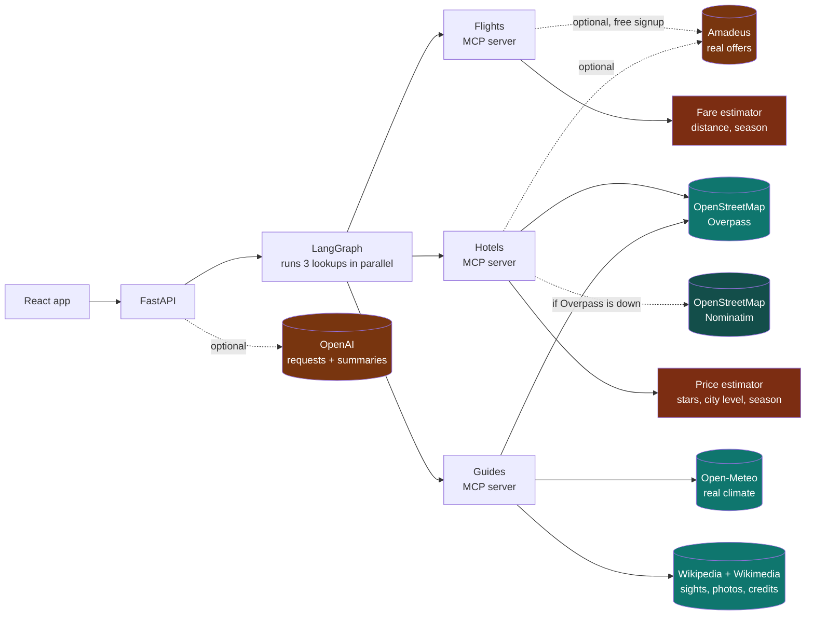
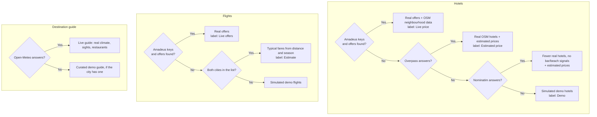
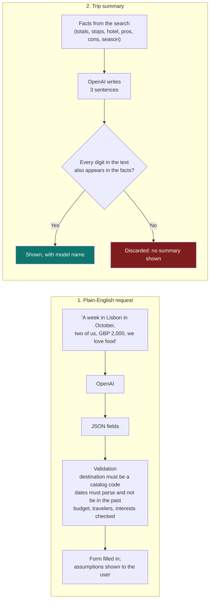

# 05 · Live data and AI

The app runs on **free public data sources** for 109 destinations across Europe, the Americas and Asia,
with optional upgrades: **Amadeus** for real flight and hotel prices, and **OpenAI** for plain-English
requests and grounded explanations. Every piece of data on screen is labelled with where it came from.

**Contents**

1. [Where the data comes from](#1-where-the-data-comes-from)
2. [Fallback ladders](#2-fallback-ladders)
3. [How each number is produced](#3-how-each-number-is-produced)
4. [OpenAI, and how it is kept honest](#4-openai-and-how-it-is-kept-honest)
5. [Configuration](#5-configuration)
6. [Limits you should know about](#6-limits-you-should-know-about)
7. [Terms of use for the free sources](#7-terms-of-use-for-the-free-sources)

---

## 1. Where the data comes from

| Piece of the app | Source | Needs signup? | Status label in the UI |
|---|---|---|---|
| The 100-city list | Curated by hand (city, country, coordinates, price level) | No | n/a |
| Best time to go, weather | **Open-Meteo** historical archive, 2019 to 2023 | No | **Live** |
| Sights and descriptions | **Wikipedia**, ranked by real 30-day page views | No | **Live** |
| Destination photos and credits | **Wikimedia Commons**, only reuse-with-credit licences | No | **Live** |
| Hotels: names, star class, location, amenities | **OpenStreetMap** | No | **Live** |
| Hotel neighbourhood signals (bars, restaurants, beach distance) | **OpenStreetMap**, computed from real positions | No | **Live** |
| Restaurants near each sight | **OpenStreetMap** | No | **Live** |
| Maps | OpenStreetMap tiles | No | n/a |
| **Flight prices** | Amadeus if configured, otherwise a distance-and-season model | Amadeus: free signup | **Live offers** or **Estimate** |
| **Hotel prices** | Amadeus if configured, otherwise a star, city and season model | Amadeus: free signup | **Live price** or **Estimated price** |
| Plain-English request, trip summary | OpenAI | Your key | shown as AI-written, with model name |
| Hotel photos | Generic illustrations (free data has none) | No | labelled "Illustrative photo" |

For the four showcase cities (Naples, Lisbon, Tokyo, Dubai) the hand-written highlights and typical costs
are kept, but their earlier **fictional venues and discounts are removed** in live mode and replaced by
real nearby restaurants. Nothing simulated is shown as if it were real.

---

## 2. Fallback ladders

Free public services are sometimes slow or down. Each server tries the best source first and degrades
in steps, and the response says which step it used.

Successful responses are cached on disk (`backend/.cache/`): weather for a year, sights for 30 days,
OpenStreetMap data for 14 days. The first search for a city can take up to a minute; after that it is quick.
If a source fails but an older cached copy exists, the stale copy is used rather than failing.

---

## 3. How each number is produced

### Best time to go (real data, transparent scoring)

Open-Meteo gives five years of daily temperatures and rainfall. For each month:

| Step | Rule |
|---|---|
| Comfort | Daytime highs of 21 to 28 °C score 1.0. Colder falls to 0 at 4 °C; hotter falls to 0 at 40 °C |
| Dryness | `1 - min(1, rainy_day_share x 1.3)`, where a rainy day is 1 mm or more |
| Month score (1 to 5) | `round(1 + 4 x (0.7 x comfort + 0.3 x dryness))` |

Your trip is scored by averaging the month score over every day you travel. This is a heuristic on real
measurements: the temperatures and rainfall are real, the 1 to 5 score is our judgement.

### Sights (real data, ranked by attention)

Wikipedia articles within 7 km of the centre are ranked by **how many people actually read them in the
last 30 days**, boosted when the description reads like an attraction. Junk (stations, schools, race
circuits) and lead images that are maps or diagrams are filtered out. Only photos under CC BY, CC BY-SA,
CC0 or public-domain licences are kept, each with author and licence.

### Hotel neighbourhood signals (real data, computed)

| Signal | How it is computed | Interest it feeds |
|---|---|---|
| Bars within 300 m | Count of OSM bars, pubs and clubs | Nightlife (6 or more) |
| Restaurants within 300 m | Count of OSM restaurants | Food scene (10 or more) |
| Distance to nearest beach | Nearest OSM beach point | Beachfront (within 500 m) |
| Distance to centre | Haversine | Old town (within 1.2 km), Quiet (over 1.5 km and few bars) |
| Amenity tags | OSM `spa`, `swimming_pool`, `dog`, and so on | Spa, Pet friendly |

If a signal is unavailable (Nominatim fallback), it is left unknown rather than guessed.

### Prices when there is no Amadeus key (estimates, labelled)

| Estimate | Formula |
|---|---|
| Hotel per night | `base(city price level 1 to 4) x star factor x season factor x small stable jitter`. Base for a 3-star: £42, £68, £100, £148. Star factors: 1 = 0.55, 2 = 0.7, 3 = 1.0, 4 = 1.55, 5 = 2.5. Season factor 0.85 to 1.25 from the weather score |
| Flight per traveler, return | `(30 + 0.075 x km) x peak-season x last-minute`, minimum £60. Five fare shapes are offered: direct standard, direct flexible, 1 stop, 1 stop budget, 2 stops |

These are **modelled, not quoted**. Free data has no live hotel prices, guest reviews or fares, so
the UI never presents estimates as real and never shows invented ratings or discounts.

---

## 4. OpenAI, and how it is kept honest

OpenAI is optional and does two jobs. It never supplies prices or facts.

- The model is told to use only the supplied facts and to say when a price is an estimate.
- Any summary containing a number that is not in the facts is thrown away, so an invented price cannot reach the screen.
- Failures (no key, timeout, bad output) simply mean no summary. The rest of the app is unaffected.
- The key is read from `backend/.env`, which is git-ignored. It is never sent to the browser.

---

### The trip builder (text and photo)

`POST /api/build-trip` takes free text and optionally one photo. The photo is shrunk to 768 px on the device, must be a small JPEG, PNG or WebP data URL, and is sent to OpenAI only for that request. The model returns trip fields and a profile (keywords, interests, place types, vibe, pace, budget style). Everything is validated: destinations must be catalog codes, interests and place types must be known keys, dates must be real and in the future. The model is told to treat the photo as a hint about taste and never to identify or describe a person.

**Prompt and form are separate.** The home page has two cards. "Describe your trip" builds from your words alone and never reads or changes the form. "Plan with the form" uses only the form and ignores the prompt and the saved profile. Anything the words do not say (origin, dates, travelers, budget) gets a fixed default, which the trip page lists as assumed.

**Which place wins.** After the model answers, the server scans the text for the 109 catalog cities and their countries (whole words, accents and case ignored, with aliases such as UK, USA and UAE; everyday words that are also city names, like "nice" or "split", are skipped):

| What the person wrote | What happens |
|---|---|
| A city we cover | That city is used, even if the model chose another or the form says something else |
| A country with one covered city | That city |
| A country with several covered cities | The model's pick if it fits the country, otherwise clickable choices. The form is never used |
| A specific city or country we do not cover (Egypt) | Reported as "not one of our 109 cities yet". No trip is planned and no other place is substituted |
| A vague wish ("somewhere warm") | The model may suggest a city and says so in its notes |

The trip page lists what came from your words and what was assumed under "How I read your request".

The profile is saved only in the browser (`localStorage`). Its place types drive the real OpenStreetMap searches for museums, pubs, parks and so on.

### Tonight: clubs and bars for one night

`GET /api/tonight?dest=OPO&date=2026-09-25&kinds=clubs,bars` returns the best places to go out in a city on a chosen night.

| Part | Source | Notes |
|---|---|---|
| Venues, hours, websites | OpenStreetMap (Overpass, Nominatim fallback) | Real places only. Cached for two weeks |
| Photos | Wikimedia Commons search by venue name and city | Kept only if the file name contains the venue's distinctive name words and the licence is CC BY, CC BY-SA, CC0 or public domain. The author and licence are shown. Cached for 30 days |
| Prices | Partner deals (our database) and Ticketmaster events (free key) | **Never estimated.** A venue with neither shows "No price published" |
| Events tonight | Ticketmaster | Optional |

Free sources have no guest reviews, so "best" means: open that night (+1.5), open past 00:30 (+0.7), a nightclub (+0.5),
well documented with a Wikipedia entry (+2), has a website (+0.5), has a photo (+0.5), has a live partner deal (+1),
and less far from the centre (-0.15 per km). Venues whose listed hours say they are closed that night are hidden and
counted. Venues with no hours listed stay in, marked "Hours not listed". The ranking rule is printed on the page.

## 5. Configuration

Copy [backend/.env.example](../backend/.env.example) to `backend/.env` and fill in what you have.

| Variable | Purpose | Default |
|---|---|---|
| `OPENAI_API_KEY` | Enables plain-English requests and AI summaries | off |
| `OPENAI_MODEL` | Which OpenAI model to use (must support images for the photo feature) | `gpt-4o-mini` |
| `OPENAI_BASE_URL` | An OpenAI-compatible endpoint (proxy, Azure, local test server) | OpenAI |
| `AMADEUS_CLIENT_ID`, `AMADEUS_CLIENT_SECRET` | Enables real flight and hotel offers | off |
| `AMADEUS_BASE_URL` | Amadeus environment | test (free) |
| `TICKETMASTER_API_KEY` | Live events and parties (free key) | off |
| `TRAVELPAYOUTS_TOKEN` | Recent real flight fares (free affiliate signup) | off |
| `STRIPE_SECRET_KEY` | Enables real payment for Featured deal placements (free test-mode account) | off |
| `STRIPE_WEBHOOK_SECRET` | Required alongside it, to trust Stripe's "payment completed" webhook | off |
| `VAPID_PUBLIC_KEY`, `VAPID_PRIVATE_KEY` | Enables real push notifications for messages and connection requests, even while closed. Generate a free pair: `python scripts/generate_vapid_keys.py` | off |
| `VAPID_SUBJECT` | Required alongside them: a contact address (`mailto:...`) push services may use if something is wrong | off |
| `ADMIN_TOKEN` | Unlocks the moderation page `/admin` | moderation off |
| `WAYFINDER_DB` | Where partner accounts and deals are stored | `backend/data/partners.db` |
| `WAYFINDER_OFFLINE` | `1` disables every network call and uses built-in demo data | `0` |

`GET /api/config` reports what is switched on, and the UI shows or hides features accordingly.
The automated tests always run with `WAYFINDER_OFFLINE=1`, so they never use the network or spend credits.

---

## 6. Limits you should know about

- **No free source has live hotel prices, guest reviews, or restaurant discounts.** Without Amadeus, prices are estimates. With Amadeus, the free test environment covers only part of the world's inventory, so some routes and cities return nothing and fall back to estimates.
- **Amadeus support has not been run against real credentials.** The parsing follows Amadeus' documented formats and is unit-tested on sample payloads, but the first real run may need small adjustments.
- **Overpass (OpenStreetMap) is often busy.** The app falls back to Nominatim, which returns fewer results and no bar or beach signals. Cached results make repeat searches reliable.
- **First search per city is slow** (often 20 to 60 seconds) while live data is gathered, then fast. Pre-warming popular cities before a demo avoids the wait.
- **Sights are ranked by attention, not by quality.** Occasionally an odd article slips through the filters.
- **Hotel photos are illustrations.** Free data does not have photos of specific hotels.
- **Hotels appear only if OpenStreetMap lists them.** Some cities have fewer or less complete entries.

---

## 7. Terms of use for the free sources

Free does not mean unrestricted. Read these before using the app beyond a demo.

| Source | Key condition |
|---|---|
| **Open-Meteo** | Free for **non-commercial** use. A commercial product needs one of their paid plans |
| **OpenStreetMap data** | ODbL licence: attribution required (shown on the map and in the app) |
| **OpenStreetMap tile server** | Fair-use policy: fine for a demo, not for heavy production traffic. Use a tile provider for real launch |
| **Overpass and Nominatim** | Public servers with usage policies (Nominatim: at most 1 request per second, identify your app). Fine for light use with caching; not for scale |
| **Wikipedia text** | CC BY-SA. Show attribution and link back (the app links each sight to its article) |
| **Wikimedia Commons photos** | Per-photo licence. Author and licence are shown on each photo, and only reuse-with-credit licences are used |
| **Amadeus** | Free tier has quotas; moving to production needs their approval |
| **OpenAI** | Billed to your account per use |

If this becomes a commercial product, the free tiers above are the first things to replace with paid,
production-grade equivalents. The architecture already isolates each source behind an MCP server, so
swapping one is a contained change.
