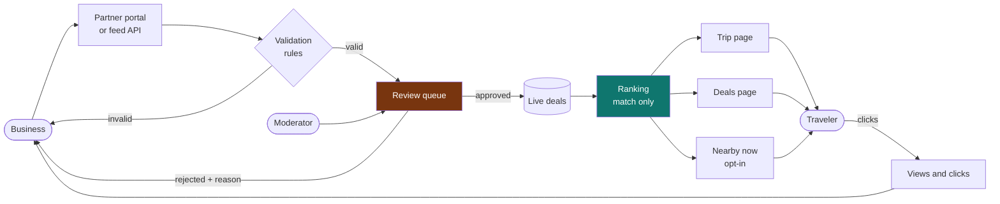
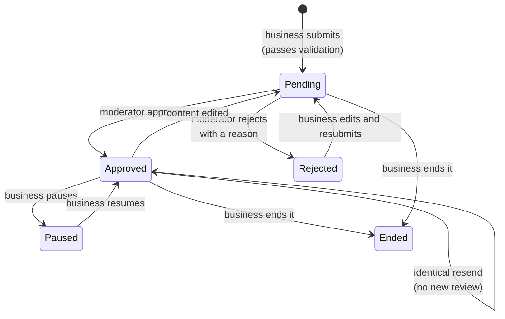
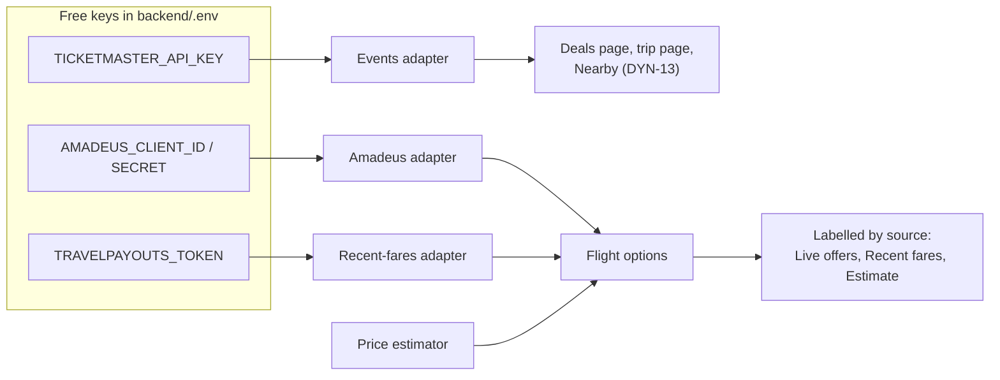

# 07 · Partner portal, deals and suppliers

How businesses put deals in front of travelers, how those deals are kept honest, and how the two optional
real-time suppliers (Ticketmaster events, Travelpayouts fares) plug in.

Related: [feature registry](FEATURES.md) · [go-live checklist](06-go-live-and-partnerships.md) · [architecture](02-architecture.md)

## 1. The idea in one picture

## 2. Life of a deal

A deal is **visible to travelers only when** it is Approved, not paused, its partner is active, and today falls
inside its dates. Anything else is hidden.

## 3. What a business must provide

| Field | Rule |
|---|---|
| Title and description | 5 to 90 and 10 to 600 characters |
| Category | Stay, restaurant, bar or pub, party or club, tour, activity, spa, car rental, flight |
| Destination | One of the 109 catalog cities |
| Location | Required for everything except flights. Must be within 40 km of the city centre |
| Price and usual price | The usual price is optional, but if given it must be higher than the deal price, and a discount over 90% is refused as a probable mistake |
| Dates | End date not in the past, and a window of at most a year |
| Booking link and photo | `https://` only |
| Terms | Required, 10 to 800 characters |
| Tags | Optional, from a fixed list, used for matching |

The discount travelers see is **computed by us** from the two prices. The business cannot type a percentage.

## 4. Keeping it honest

| Promise | How it is enforced |
|---|---|
| A person checks every deal before it shows | New and changed deals start as Pending. Identical resends do not restart review |
| Payment cannot buy rank | `rank_deals` has no input for who the partner is or what they pay. A test proves that adding "paid" fields changes nothing |
| Paid content is always labelled | Every partner deal carries a "Partner deal" badge, on the trip page, deals page, Nearby and previews |
| No fake urgency | "Ends today" is shown as information and nudges rank only slightly (DYN-12). Stock is shown only as "per the business" |
| Real prices only | The usual price is the business's claim, flagged to reviewers when large (60%+) or missing |
| A bad partner can be stopped | Suspending a partner hides their deals and blocks sign-in at once |
| Money can buy visibility, never rank | A Featured placement (below) is a real payment, but it only ever appears in its own separate, labelled strip. It is never an input to `rank_deals` |

Ranking score: `1.0 + 0.4 per matching tag (max 2) + real discount (max 0.5) - distance penalty`.

### Featured deal placements

The one thing money buys: a partner pays **$19 for 7 days** (Stripe Checkout, test mode until a live key is
configured) to pin one of their own **approved** deals in a "★ Featured this week" strip for a destination.

- The strip is always separate from, and shown alongside, the ranked deals list below it -- paying for it never
  reorders or filters that list, and both the strip and the badge say so.
- Payment is confirmed by Stripe's webhook, not by the checkout redirect (a person can close the tab; the webhook
  is the source of truth). The webhook's signature is verified (`app/partners/stripe_gateway.py`, manual
  HMAC-SHA256, no SDK) before anything in its body is trusted, and marking a session paid is idempotent, since
  Stripe retries webhook delivery.
- Off by default: `GET /api/config` reports `payments: false` until `STRIPE_SECRET_KEY` and
  `STRIPE_WEBHOOK_SECRET` are both set in `backend/.env`. The dashboard's "Feature" button is visible but disabled,
  with an explanation, until then -- the same pattern as every other optional paid integration in this app.
- We never see or store a card number: Stripe hosts the payment page.

## 5. Accounts and security

- Passwords: scrypt with a random salt. Minimum 10 characters.
- Sessions: random token, stored only as a SHA-256 hash, valid for 7 days, ended on logout or suspension.
- API keys: shown once, stored only as a hash. Creating a new key stops the old one working.
- Rate limits on sign-up, sign-in, the feed, address search and admin attempts.
- Moderation is switched off until `ADMIN_TOKEN` is set in `backend/.env`. It is compared in constant time.
- Data lives in a SQLite file, `backend/data/partners.db` (git-ignored). The schema is plain SQL, so moving to Postgres later is a driver change.

**Not built yet:** email verification (there is no mail service), password reset, invoicing, refunds, and
multi-user teams per business. Until email verification exists, the moderator is the check that a business is real.
Featured placements (below) are the one payment flow that is built; regular deal listing is still free.

## 6. API

| Endpoint | Who | Purpose |
|---|---|---|
| `GET /api/deals?dest=OPO&interests=&place_types=&category=&start=&end=` | Public | Ranked partner deals for a city |
| `POST /api/deals/{id}/click` | Public | Count a click on "Get this deal" |
| `POST /api/bookings/deal` | Public | "Book now" as a demo: checks the deal is approved and running that day and within stock, prices it from the database, returns a voucher and reference. `pay` is `venue` (default: pay at the place on arrival, the voucher holds the price) or `now` (paid in the app). Counts as a click in the partner's stats. Nothing is reserved or charged |
| `POST /api/bookings/deal/{reference}/cancel` | Manage token | Cancel a demo deal booking (not once the voucher is used) |
| `GET /api/bookings/deal/{reference}` | Manage token | The booking's status now: booked, cancelled or used at the place |
| `GET /api/partners/reservations` | Partner | Bookings of this business's own deals: day, time of day, how many, total, how it's paid, voucher, status. Never who booked |
| `POST /api/partners/reservations/check` | Partner | Look up a voucher or booking reference among this business's reservations, with warnings (another day, cancelled, used) |
| `POST /api/partners/reservations/{reference}/redeem` | Partner | Mark a reservation as used at the place, once |
| `GET /api/deals/options` | Public | Categories, tags, currencies and the disclosure text |
| `GET /api/events?dest=OPO&start=&end=` | Public | Ticketmaster events (empty until a key is set) |
| `POST /api/partners/register`, `/login`, `/logout` | Business | Account and session |
| `GET /api/partners/me` | Business | Profile, totals, and every deal with views and clicks |
| `POST /api/partners/deals`, `PUT/DELETE /api/partners/deals/{id}` | Business | Create, edit, end |
| `POST /api/partners/deals/{id}/pause` | Business | Pause or resume |
| `GET /api/partners/geocode?q=&dest=` | Business | Street address to coordinates (OpenStreetMap) |
| `POST /api/partners/api-key` | Business | New feed key |
| `GET /api/deals/featured?dest=OPO` | Public | Currently-paid Featured deals for a city |
| `POST /api/partners/deals/{id}/feature` | Business | Start payment to feature one of my own approved deals (returns a Stripe Checkout URL) |
| `POST /api/payments/stripe/webhook` | Stripe | Confirms a Featured-placement payment; signature-verified |
| `POST /api/partner-feed` (header `X-API-Key`) | Business system | Bulk create or update, up to 100 per call |
| `GET /api/admin/deals`, `POST .../approve`, `.../reject` | Moderator (`X-Admin-Token`) | Review queue |
| `GET /api/admin/partners`, `POST .../status` | Moderator | See and suspend partners |

Feed items need a stable `external_id` and an explicit `valid_from`, so a nightly resend of the same deal
updates it instead of restarting review.

## 7. Where deals appear

- **Trip page:** "Partner deals for your trip", limited to deals that overlap the trip dates, best match first.
- **Deals page (`/deals`):** a "★ Featured this week" strip first (if any), then any city, filters by category, an
  optional "only for my trip dates" switch, and a map. The Featured strip and the ranked list below it never mix.
- **Nearby now:** deals within walking range, only when the traveler has switched Nearby on (rules DYN-11 and DYN-12).
  This works even offline, because deals come from our own database.

## 8. Optional real-time suppliers

| Supplier | Gives | Label in the app | Status |
|---|---|---|---|
| Ticketmaster Discovery API | Concerts, shows, sports near a city or you | "Events by Ticketmaster", link to their page | Written and tested on a sample payload. Not yet run with a real key |
| Travelpayouts (Aviasales data API) | Recent fares other travelers found | "Recent fares" (never "Live") | Written and tested on a sample payload. Not yet run with a real token |
| Amadeus Self-Service | Real flight and hotel offers | "Live offers" | Written earlier, not yet run with real credentials |

Flight price order: Amadeus, then Travelpayouts, then labelled estimates. Airlines from Travelpayouts show as
their two-letter code. Affiliate booking links (which earn commission) are set up in the Travelpayouts dashboard
once approved and are not wired in yet.

## 9. Trying it

1. Add `ADMIN_TOKEN` to `backend/.env` (already generated for you in this copy) and restart the server.
2. Open `/partners`, create an account, and post a deal.
3. Open `/admin`, enter the token, and approve it.
4. Open `/deals` or plan a trip to that city.
5. To fill the app with clearly-labelled demo businesses: `python scripts/seed_demo.py` (undo with `--remove`).
