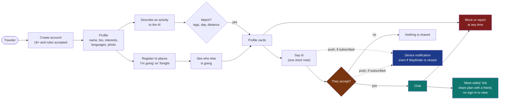

# 09 · People: meeting other travelers, and keeping them safe

Wayfinder People lets travelers register to places, see who else is going, describe an activity to the AI, find
people nearby who want the same, and chat once both sides agree. Because it puts strangers in touch with each other,
safety is designed in, not added later.

Related: [feature registry](FEATURES.md) · [API reference](08-api-reference.md) · [partner portal](07-partner-portal-and-deals.md)

## 1. What a person can do

## 2. The safety rules built into the code

| Risk | What the app does |
|---|---|
| Minors | Sign-up needs a birth year showing 18 or older, and a ticked box accepting the rules. This is self-declared. It is not identity verification |
| Unwanted contact | Nobody can message anyone. A person sends one request with a short note, and chat opens only if the other person accepts. Asking someone who already asked you connects you |
| Harassment | Block and Report are on every profile card and in every chat. Blocking hides both people from each other everywhere and closes the chat. Reports go to a moderator queue, and a ban ends the person's sessions at once |
| A harmful profile before a moderator gets to it | **Auto-hide pending review**: a profile is hidden from search, place lists and new contact the moment a report names "under 18" or "unsafe behaviour", or once two different people have an open report against it. It is not a ban — the person can still sign in and use existing chats, and it lifts automatically once every open report against them is resolved. See `app/social/connect.py::_recompute_review` |
| Meeting a stranger in person | **"Meet safely" check-ins**: from any chat, either person can create a link with the place, time and who they are meeting, to send to a friend outside the app. No sign-in is needed to view it, and it never carries an exact location, email or phone number. It expires 12 hours after the planned time, or the moment its owner ends it |
| Fake or unsafe photos | A photo is shown to others only after approval. With an OpenAI key it is checked by OpenAI's free moderation endpoint. Without one it waits in the moderator queue. Rejected photos are deleted. The address of a photo is a random 128-bit name |
| Bad messages | Messages and notes are checked by moderation when a key is set. Length limits and rate limits apply. Any message can be reported |
| Stalking and location | Only place-level facts are shared ("going to X on Tuesday"). A request stores a position rounded to about 1 km and expires with its day. Others see "within 1 km", never coordinates. Live position is never shared |
| Filters and discrimination | Searching by gender or age band is supported, and it is voluntary on both sides: only people who chose to share a gender are returned by a gender search, and every person can limit who may find them (for example women only). Filters by ethnicity, religion, sexuality or looks are not offered; a request that asks for them is told so and they are never applied |
| Data | Emails, birth years, exact ages and exact locations are never shown to other people. A person can hide their profile, and can delete their account, photo, plans, requests and messages for good. The activity log holds no names, emails or coordinates |
| Scams | The rules tell people never to send money. Reports of "spam or scam" are a category |
| Under 18 discovered | "under 18" is a report reason. It hides the profile at once (see above), and a moderator can ban the account |
| A push notification on a lock screen | Push previews carry a sender's display name and the first line of a message, the same as any other messaging app's lock-screen preview. Anyone worried about that can turn the "Notify me on this device" toggle off, or use their phone's own setting to hide notification content |

## 3. How matching works

The AI only **reads** the request. It turns free text into tags from a fixed list (nightlife, live music, food, coffee,
museums, hiking and so on), plus languages, vibes, the day and the time of day. Without an OpenAI key a simpler
keyword reader does the same. Matching is then plain arithmetic:

`score = 3 per shared activity + 1 per shared language + 0.5 per shared vibe + 0.5 for the same time of day - distance / radius`

A candidate must share at least one activity, want it on the same day, be discoverable, not be blocked in either
direction, be inside both people's search distances, fit the searcher's gender or age filter if there is one, and
have a "who can find me" limit that the searcher passes. A second list shows places nearby where discoverable
people are going that day.

### Gender and age

- **On a profile:** gender is optional and shown only if chosen. The age band (18-24, 25-34, 35-44, 45-54, 55+) is shown only if the person switches it on. The exact age and the birth year are never shown.
- **In a search:** write it ("women aged 25-30", "guys in their 30s", "someone under 30") or tap the chips. Chips win over the words. Only people who chose to share a gender appear in a gender search.
- **Who can find me:** a person can limit their visibility by gender and age band. The limit applies to searches, the list of people going to a place, and connection requests. It works one way: a woman who chooses "only woman" is hidden from men, and can still see everyone.
- **Not offered:** ethnicity, religion, sexuality and looks. They are not stored and never applied.

## 4. Places

"I'm going" on a Tonight venue registers a place and day. A public number shows how many discoverable people are
going. Signed-in people can open the list and see the profile cards. A person can register for up to ten places a day,
up to two weeks ahead.

## 5. Moderation

At `/admin`, with the admin token:

- **Profile photos waiting for review:** approve or reject.
- **Open reports:** dismiss, or ban. The list shows how many reports are open against each person, and marks "Auto-hidden" when the profile is already hidden pending this review (see auto-hide, above). Dismissing every open report against a person un-hides them; banning ends their account.

## 6. What is not built, and what you must do before real users

- **Identity is not verified.** A photo is not proof that a person is who they say. Email verification does not exist yet.
- **Chat uses polling** every few seconds, not push. Notifications for new requests and messages are not built.
- **No age verification** beyond the declaration. Depending on your country, a legal review of how you handle age is wise.
- **Privacy policy and terms** must be written and shown at sign-up. Storing photos, messages and locations makes you a data controller under GDPR and similar laws.
- **Moderation capacity:** someone must review photos and reports every day, or turn on the OpenAI key so photos are checked automatically. Auto-hide (above) buys time, not a substitute for review.
- **Emergency information:** local emergency numbers are not shown in the app yet. A "trusted contact" who is told *before* a meetup, not just handed a link after asking, would need a proper contacts feature; today's check-in link (above) covers the "tell a friend" habit the safety rules already ask for, but relies on the person actually sending it.
- **Scale:** SQLite and local photo files suit a prototype. Move to Postgres and object storage before real traffic.
- **The pool starts empty.** Until people join, matches are empty. See the demo pool below for a labelled set of 100 made-up travelers.

## 7. The demo pool

`python scripts/seed_people.py` creates **100 made-up travelers**: 20 each in Ibiza, Barcelona, Tel Aviv, Berlin and Paris,
from 26 countries, women, men and non-binary people from 18 to 68 (about a quarter each in their twenties, a third in
their thirties, and so on down to 55+). Each has a bio, hobbies, languages, interests and a request for today or tomorrow.

- **Labelled:** every card shows "demo" and an "AI" mark on the picture, emails end in `@wayfinder.invalid`, and the chat banner says replies are automated.
- **AI portraits, not real people:** the pictures are portraits of fictional adults generated by OpenAI's image model from written descriptions (`python scripts/generate_demo_photos.py`, about a dollar for 100 on the low-quality setting). They carry an "AI" mark, and no real person's photo is used or implied. Without them, an illustrated avatar is drawn instead.
- **Static:** the 100 profiles and their first requests exist as soon as you seed. The night-life crowd is registered to real venues from OpenStreetMap, so the Tonight page shows "N going".
- **Dynamic:** every day (and at server start) people without a request post a new one: a morning run, padel, a techno night, a museum, a hike. When a real person posts a request near one of the five cities, a few demo people who fit it, and any gender or age filter it uses, post a matching one for the same day. Far from the five cities nothing is invented.
- **Chat:** saying hi to a demo profile accepts at once, and it replies with canned lines.
- **Remove:** `python scripts/seed_people.py --remove` deletes them and everything attached. `--refresh` posts today's requests by hand. Seeding takes a few minutes the first time because it looks up real venues; they are cached afterwards.

Demo profiles live in the same database as real people. **Do not seed them in a real launch**, or remove them first.

## 8. Real push notifications

A "Notify me on this device" toggle in the People profile subscribes this browser to real Web Push (RFC 8291
message encryption, RFC 8292 VAPID) -- the one place Wayfinder reaches a device while it is fully closed, not
just backgrounded. Off by default; `GET /api/config` reports `push: false` until `VAPID_PUBLIC_KEY`,
`VAPID_PRIVATE_KEY` and `VAPID_SUBJECT` are all set (`python scripts/generate_vapid_keys.py` makes a free pair
in seconds -- it is not a paid or billed credential).

- **Tied to the account, not the browser tab.** A subscription belongs to a signed-in Wayfinder Person
  (`push_subscriptions.user_id`), so a push can be sent from anywhere in the backend that knows *who*, at any
  time, not only while that person's page happens to be open and polling.
- **What triggers it:** a new connection request, a request you sent being accepted, and a new chat message.
  All three fire from the real write in `app/social/connect.py`, not a separate poller.
- **No SDK.** Message encryption and the VAPID JSON Web Token are built directly on `cryptography`'s
  primitives (`app/social/push.py`), the same approach as `app/partners/stripe_gateway.py` for payments.
- **Demo profiles are silently skipped**, since they have no device of their own to notify, and a human who
  messages one already sees the automated reply immediately in the UI.
- **Stale subscriptions clean themselves up:** a 404 or 410 from the push service (the browser un-subscribed,
  or the subscription expired) removes the row so it is never retried.
- Only a title, a short body and a destination URL are ever sent -- never a coordinate, an email or a phone number.

## 9. Settings

`OPENAI_API_KEY` (moderation and reading requests), `ADMIN_TOKEN` (the moderator page), `STRIPE_SECRET_KEY` /
`STRIPE_WEBHOOK_SECRET` (Featured deal payments, not People-specific but documented in doc 07),
`VAPID_PUBLIC_KEY` / `VAPID_PRIVATE_KEY` / `VAPID_SUBJECT` (push, above), and `WAYFINDER_DB` (photos live in a
`people_photos` folder next to the database file).
