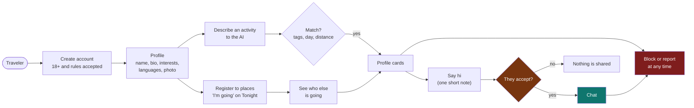

# 09 · People: meeting other travelers, and keeping them safe

Wayfinder People lets travelers register to places, see who else is going, describe an activity to the AI, find
people nearby who want the same, and chat once both sides agree. Because it puts strangers in touch with each other,
safety is designed in, not added later.

Related: [feature registry](FEATURES.md) · [API reference](08-api-reference.md) · [partner portal](07-partner-portal-and-deals.md)

## 1. What a person can do

## 2. The safety rules built into the code

| Risk | What the app does |
|---|---|
| Minors | Sign-up needs a birth year showing 18 or older, and a ticked box accepting the rules. This is self-declared. It is not identity verification |
| Unwanted contact | Nobody can message anyone. A person sends one request with a short note, and chat opens only if the other person accepts. Asking someone who already asked you connects you |
| Harassment | Block and Report are on every profile card and in every chat. Blocking hides both people from each other everywhere and closes the chat. Reports go to a moderator queue, and a ban ends the person's sessions at once |
| Fake or unsafe photos | A photo is shown to others only after approval. With an OpenAI key it is checked by OpenAI's free moderation endpoint. Without one it waits in the moderator queue. Rejected photos are deleted. The address of a photo is a random 128-bit name |
| Bad messages | Messages and notes are checked by moderation when a key is set. Length limits and rate limits apply. Any message can be reported |
| Stalking and location | Only place-level facts are shared ("going to X on Tuesday"). A request stores a position rounded to about 1 km and expires with its day. Others see "within 1 km", never coordinates. Live position is never shared |
| Discrimination | People are never filtered or ranked by gender, age, looks, ethnicity, religion or sexuality. If a request asks for that, the AI ignores it and tells the person. Matching uses activity, language, vibe, day and distance only |
| Data | Emails, birth years and exact locations are never shown to other people. A person can hide their profile, and can delete their account, photo, plans, requests and messages for good. The activity log holds no names, emails or coordinates |
| Scams | The rules tell people never to send money. Reports of "spam or scam" are a category |
| Under 18 discovered | "under 18" is a report reason. A moderator can ban the account |

## 3. How matching works

The AI only **reads** the request. It turns free text into tags from a fixed list (nightlife, live music, food, coffee,
museums, hiking and so on), plus languages, vibes, the day and the time of day. Without an OpenAI key a simpler
keyword reader does the same. Matching is then plain arithmetic:

`score = 3 per shared activity + 1 per shared language + 0.5 per shared vibe + 0.5 for the same time of day - distance / radius`

A candidate must share at least one activity, want it on the same day, be discoverable, not be blocked in either
direction, and be inside both people's search distances. A second list shows places nearby where discoverable
people are going that day.

## 4. Places

"I'm going" on a Tonight venue registers a place and day. A public number shows how many discoverable people are
going. Signed-in people can open the list and see the profile cards. A person can register for up to ten places a day,
up to two weeks ahead.

## 5. Moderation

At `/admin`, with the admin token:

- **Profile photos waiting for review:** approve or reject.
- **Open reports:** dismiss, or ban. The list shows how many reports are open against each person.

## 6. What is not built, and what you must do before real users

- **Identity is not verified.** A photo is not proof that a person is who they say. Email verification does not exist yet.
- **Chat uses polling** every few seconds, not push. Notifications for new requests and messages are not built.
- **No age verification** beyond the declaration. Depending on your country, a legal review of how you handle age is wise.
- **Privacy policy and terms** must be written and shown at sign-up. Storing photos, messages and locations makes you a data controller under GDPR and similar laws.
- **Moderation capacity:** someone must review photos and reports every day, or turn on the OpenAI key so photos are checked automatically.
- **Emergency information:** add local emergency numbers and a "trusted contact" feature before wide launch.
- **Scale:** SQLite and local photo files suit a prototype. Move to Postgres and object storage before real traffic.
- **The pool starts empty.** Until people join, matches are empty. `python scripts/seed_people.py` adds clearly-labelled demo travelers for demonstrations (`--remove` deletes them).

## 7. Settings

No new environment variables. It uses `OPENAI_API_KEY` (moderation and reading requests), `ADMIN_TOKEN` (the moderator page)
and `WAYFINDER_DB` (photos live in a `people_photos` folder next to the database file).
