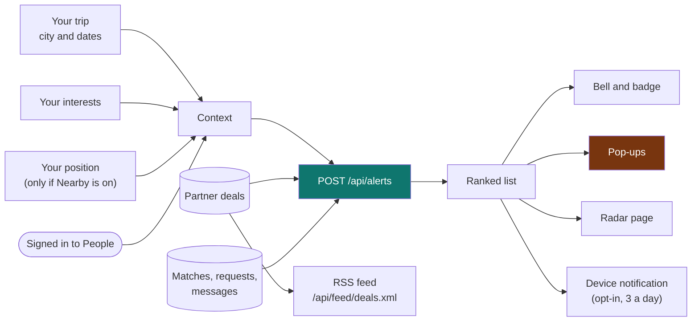

# 10 · Alerts (the radar) and the demo businesses

How Wayfinder tells someone the moment something good appears, and the labelled demo pool that makes it show up before
real businesses join.

Related: [feature registry](FEATURES.md) · [partner portal](07-partner-portal-and-deals.md) · [people and safety](09-people-and-safety.md) · [API reference](08-api-reference.md)

## 1. What an alert is

| Kind | What triggers it | What you see |
|---|---|---|
| **Deal** | A good partner deal on your planned trip (dates overlap), or inside your chosen radius when Nearby is on, that fits what you like | A picture, a discount burst ("-40%"), the price and usual price, a countdown when it ends soon, and why it was picked ("During your trip to Tel Aviv", "2.1 km away", "Matches what you like") |
| **Person** | Someone whose request matches one of yours | Their **profile card** with photo, shared interests, distance band and "Say hi" |
| **Request** | Someone asked to connect | Their profile, their note, and Accept or Not now on the spot |
| **Message** | A new chat message from the other person in the last 24 hours | Their profile and the message, and "Open chat" |

A deal is **hot** when the discount is 30% or more, or it ends tonight. Hot alerts rank first, and pop up.

## 2. How it reaches you

- **The bell** in the top bar shows a pulsing badge with the number of new alerts. Opening it shows the best four.
- **Pop-ups** slide in when something new and good appears, wherever you are in the app. The first load shows only the single best one, and later loads show at most two new ones.
- **The Radar page (`/alerts`)** lists everything with tabs (deals, people, messages), settings, and a highlight on what is new.
- **The trip page** has a "Hot right now for your trip" strip.
- **Device notifications** are opt-in (Radar settings), limited to 3 a day for all alerts together, never between 10 pm and 8 am, and work while the app is open. True background push to a closed phone is not built.
- **RSS:** `GET /api/feed/deals.xml?dest=TLV&interests=nightlife&min_discount=20` is a public feed of the same deal alerts, for feed readers and other apps. It is standard RSS 2.0 with everything escaped.

The server only works out the list. The browser remembers which alerts you have seen (in `localStorage`), so nothing about what you read is stored on the server.

## 3. Settings

On the Radar page: deals on or off, people on or off, the smallest discount to alert on (0 to 50%), the radius around your position (1 to 25 km), and device notifications.

## 4. Honesty rules

- Deals are ranked by how well they match you, never by who pays (see [07](07-partner-portal-and-deals.md)). Every deal is labelled "Partner deal".
- "Ends tonight" and the countdown are facts taken from the deal's end date, not invented urgency.
- Paused, expired or suspended partners never alert.
- Your position is used only for the request and is never stored. Alert cards show distances, not coordinates.
- People, requests and messages need a People account. Other people's alerts are never visible to you, and blocked people never appear.

## 5. The demo businesses

`python scripts/seed_demo.py` creates **124 made-up businesses** so alerts, deals and the RSS feed can be shown:

- **Where:** 8 each in Tel Aviv, Berlin, Barcelona, Paris and Ibiza; 3 each in 20 more cities (London, Lisbon, Rome, Amsterdam, Madrid, Athens, Istanbul, Dubai, New York, Miami, Mexico City, Rio, Buenos Aires, Tokyo, Bangkok, Singapore, Seoul, Los Angeles, Copenhagen, Vienna); and 3 each in 8 Australian cities (Sydney, Melbourne, Brisbane, Perth, Adelaide, Gold Coast, Cairns, Hobart).
- **What:** restaurants, bars, clubs, tours, activities, spas, hotels and car rental, each with a standing deal that runs for weeks or months, so a trip a few months away still finds deals.
- **Labelled:** every name starts with "Demo ·", emails end in `@wayfinder.invalid`, and booking links point at example.com.
- **Pictures:** an AI photo of a generic, fictional venue for the category (restaurant, bar, party, tour, activity, spa, hotel, car rental), marked "AI" on the card -- `python scripts/generate_demo_business_photos.py`, four varied photos per category, reused across every deal in it. Falls back to a drawn illustration for any category with none generated.
- **Dynamic:** every day (and when the server starts) expired deals are renewed and about 30 businesses post a **"Tonight only"** flash deal.
- **Remove:** `python scripts/seed_demo.py --remove`. `--refresh` posts today's deals by hand.

Demo businesses live in the same database as real ones. **Do not seed them in a real launch**, or remove them first.

## 6. What is not built

- Email or SMS alerts.
- Alerts for events from Ticketmaster (the adapter exists, but alerts use partner deals only).
- A per-alert "snooze" or per-business mute.

Background push to a closed phone or browser is now built -- see
[09 · People and safety §8](09-people-and-safety.md).
