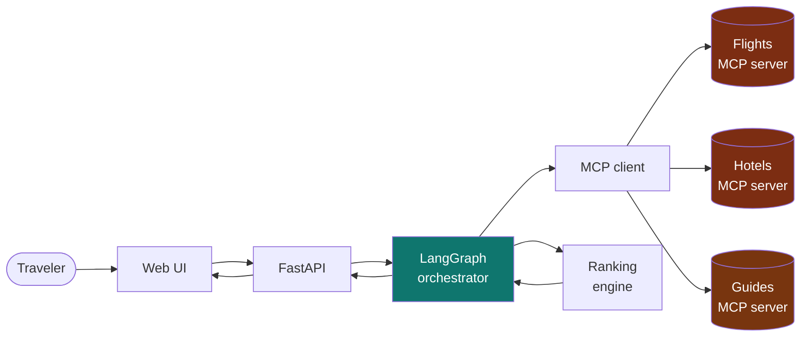

# Wayfinder AI · Documentation

An AI trip planner: one request in, a ranked and explained flight + hotel itinerary out. Built on
FastAPI, LangGraph and MCP.

| Document | Answers |
|---|---|
| [01 · System flows](01-system-flows.md) | How does a request move through the system? User journey, sequence, LangGraph pipeline, ranking, refresh, errors, lifecycle |
| [02 · Architecture](02-architecture.md) | What are the pieces and how do they connect? Context, runtime, layers, code map, API, target architecture, roadmap |
| [04 · Front end and visual experience](04-frontend-and-visual-experience.md) | What does the app look like and how is it built? Page map, components, photo licensing, maps and deals, and exactly which numbers are real, computed, curated or simulated |
| [Feature registry](FEATURES.md) | The master list of every feature, its status, what powers it, where the code is, and the dynamic rules the app applies at runtime |
| [05 · Live data and AI](05-live-data-and-ai.md) | Where does the real data come from, what is estimated, how does OpenAI stay honest, and what are the free-tier limits and terms? |
| [06 · Go live and partnerships](06-go-live-and-partnerships.md) | What exactly do I have to do to go live? Requirements in order, who to partner with, the phone process (traveler push and calling businesses), rules and a week-by-week checklist |
| [07 · Partner portal, deals and suppliers](07-partner-portal-and-deals.md) | How do businesses add deals, how are they reviewed and kept honest, and how do Ticketmaster events and Travelpayouts fares plug in? |
| [08 · API reference](08-api-reference.md) | Generated from the code: every endpoint and who can call it, page routes, nearby rules, and settings. Never edit by hand |
| [09 · People and safety](09-people-and-safety.md) | How travelers register to places, find people for an activity, and chat, and every safety rule built into it |
| [10 · Alerts and demo businesses](10-alerts-and-demo-businesses.md) | How the radar finds good deals and matching people for you, how alerts reach you (bell, pop-ups, RSS, notifications), and the 124 labelled demo businesses |
| [03 · Technology and models](03-technology-and-models.md) | What does each technology do, and how do the data, scoring, pros/cons and guide models work? Includes a worked scoring example |

## The system in one picture



Orange = simulated or curated data source. Everything else is working code.

## Status at a glance

- **Live (free sources, no keys):** 109 destinations across Europe, the Americas and Asia with real weather (Open-Meteo), sights and credited photos (Wikipedia/Wikimedia), and real hotels and restaurants (OpenStreetMap).
- **Optional upgrades:** Amadeus keys for real flight and hotel prices; an OpenAI key for plain-English requests and grounded trip summaries.
- **Working:** multi-page React app with photos, maps and charts, REST API with validation, LangGraph orchestration, three MCP tool servers (flights, hotels, destination guides), weighted ranking with a plain-language rationale, computed pros and cons, best-time-to-go assessment, 212 passing tests.
- **Estimated (labelled):** flight and hotel prices when no Amadeus key is set. Free data has no live prices or guest reviews.
- **Simulated:** only the offline demo fallback, used when the live sources are unreachable.
- **Curated:** hand-written highlights and typical costs for Naples, Lisbon, Tokyo and Dubai.
- **Partner side:** businesses sign up, post deals, and a moderator approves them; deals show on the trip page, the deals page and Nearby, always labelled and never ranked by payment. See [07](07-partner-portal-and-deals.md).
- **Not yet built:** email verification, payments, traveler accounts, rental car search, background push to a closed phone, a native mobile app. See the [roadmap](02-architecture.md#9-roadmap).

## Run it

```
cd backend
.venv\Scripts\python.exe -m uvicorn app.main:app --reload
```

Optional: copy `backend/.env.example` to `backend/.env` and add your OpenAI and/or Amadeus keys (see [05](05-live-data-and-ai.md#5-configuration)).

Open http://localhost:8000. API docs at http://localhost:8000/docs.

The web app is a React build. Build it once with `cd frontend && npm install && npm run build`; see
[04](04-frontend-and-visual-experience.md#7-running-and-building) for the development workflow.

## Viewing the diagrams

Diagrams use Mermaid. They render automatically on GitHub. In VS Code, install the
*Markdown Preview Mermaid Support* extension, then open the Markdown preview.
